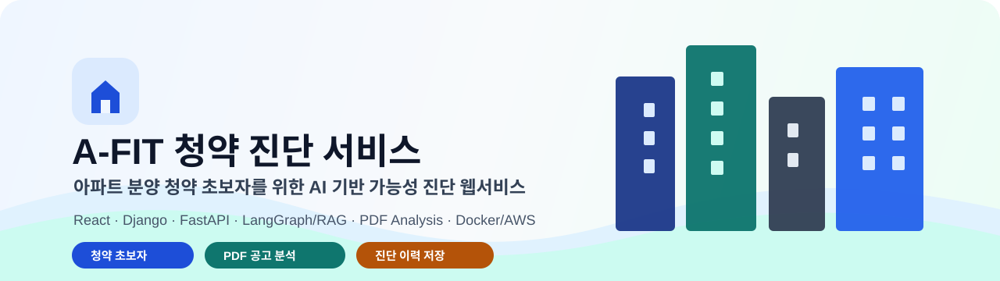
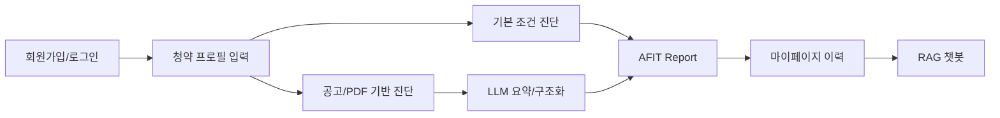
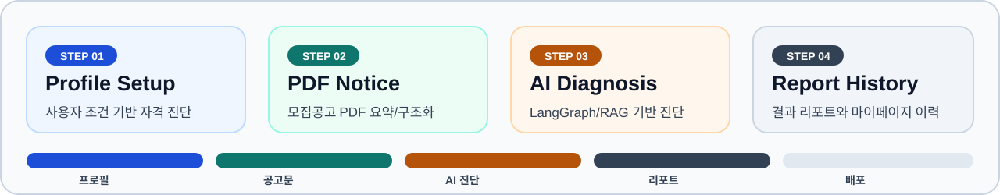
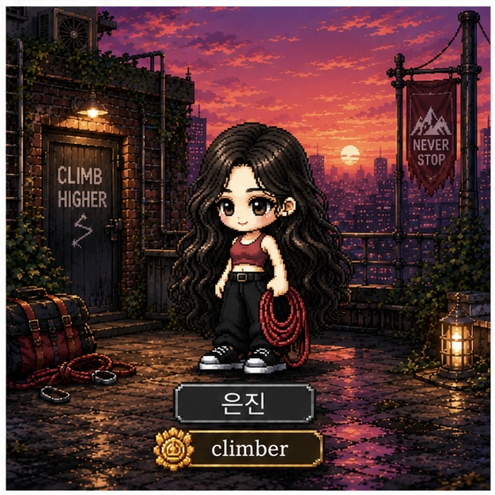
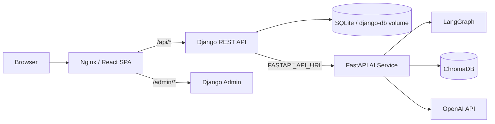
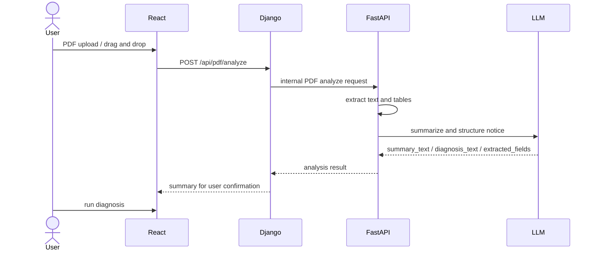
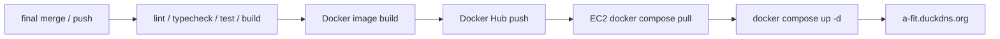
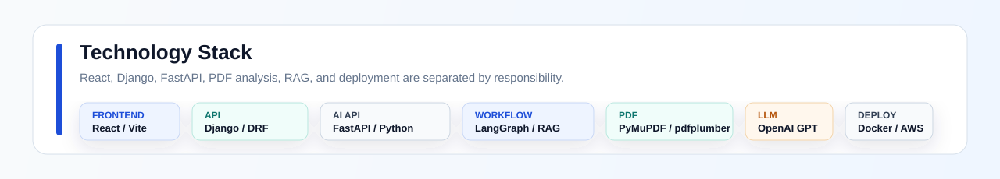

# A-FIT

<div align="center">



<br/>
<br/>

### 아파트 분양 청약을 처음 준비하는 사용자를 위한 AI 기반 청약 가능성 진단 서비스

사용자 청약 조건과 모집공고 PDF를 바탕으로 청약 가능성을 진단하고, 결과 리포트와 공고별 분석 이력을 다시 확인할 수 있는 웹서비스입니다.

<br/>


</div>

---

## Overview

A-FIT은 청약 초보자가 복잡한 청약 조건과 모집공고를 혼자 해석하기 어렵다는 문제에서 출발했습니다. 사용자는 프로필을 입력하고, 관심 있는 아파트 모집공고 PDF를 업로드하거나 공고 내용을 직접 입력해 청약 가능성을 참고용으로 진단받을 수 있습니다.

서비스는 세 가지 원칙으로 설계했습니다.

| 원칙 | 설명 |
|---|---|
| 계산과 설명 분리 | 자격/점수/조건 비교는 코드와 도메인 로직으로 처리하고, 설명과 요약은 LLM이 보조합니다. |
| 원본보다 정리된 정보 | PDF 원본은 저장하지 않고, 사용자 확인용 요약과 진단용 구조화 텍스트만 남깁니다. |
| 다시 볼 수 있는 진단 | 분석 결과를 마이페이지에 저장해 공고별 이력과 기본 진단 결과를 재확인할 수 있습니다. |



---

## Current Status

| 항목 | 상태 |
|---|---|
| 웹 애플리케이션 | React/Vite 기반 SPA 구현 |
| 인증/저장 | Django session 인증, 프로필/진단 이력 저장 |
| AI 엔진 | FastAPI 기반 LangGraph/RAG/PDF 분석 연동 |
| PDF 분석 | PDF 텍스트/표 추출, LLM 요약, 진단 입력 연결 |
| 배포 | Docker Hub 이미지 기반 AWS EC2 배포 |
| 운영 URL | `http://a-fit.duckdns.org/` |
| CI/CD | GitHub Actions 기준 검증, 이미지 빌드/푸시, EC2 배포 흐름 정리 |

---



---

## Table of Contents

| 구분 | 내용 |
|---|---|
| 1 | [Team](#1-team) |
| 2 | [Features](#2-features) |
| 3 | [Architecture](#3-architecture) |
| 4 | [PDF and AI Flow](#4-pdf-and-ai-flow) |
| 5 | [Deployment](#5-deployment) |
| 6 | [Tech Stack](#6-tech-stack) |
| 7 | [Getting Started](#7-getting-started) |
| 8 | [Verification](#8-verification) |
| 9 | [Troubleshooting](#9-troubleshooting) |
| 10 | [Project Structure](#10-project-structure) |
| 11 | [Screenshots](#11-screenshots) |
| 12 | [Final Deliverables](#12-final-deliverables) |
| 13 | [Retrospective](#13-retrospective) |

---

## 1. Team

<table width="100%">
  <tr>
    <td align="center" width="25%">
      <br/>
      <h3>준억</h3>
      <b>Backend · Integration</b><br/>
      <sub>Django/FastAPI 연동, PDF 개선, 산출물 정리</sub>
    </td>
    <td align="center" width="25%">
      <br/>
      <h3>동윤</h3>
      <b>Deployment · Backend</b><br/>
      <sub>Docker/AWS 배포, Nginx/Gunicorn 운영 설정</sub>
    </td>
    <td align="center" width="25%">
      <br/>
      <h3>지훈</h3>
      <b>AI Backend · Planning</b><br/>
      <sub>LangGraph, RAG, 청약 진단 파이프라인</sub>
    </td>
    <td align="center" width="25%">
      <br/>
      <h3>은진</h3>
      <b>Frontend · Planning</b><br/>
      <sub>React 화면, 사용자 흐름, UI 개선</sub>
    </td>
  </tr>
</table>

| 팀원 | 역할 | 담당 영역 |
|---|---|---|
| 준억 | Backend / Integration | Django-FastAPI 연동, PDF 공고문 요약/진단 연결, 마이페이지/결과 UX 보강, 최종 산출물 정리 |
| 동윤 | Deployment / Backend | Docker 이미지 빌드/푸시, AWS EC2 배포, Nginx 80포트 단일화, Gunicorn/관리자 프록시 설정 |
| 지훈 | AI Backend / Planning | LangGraph 진단 파이프라인, RAG 챗봇, 청약 계산/전략 흐름 설계 |
| 은진 | Frontend / Planning | React/Vite 화면 구현, API 연동 UI, 프로필/진단/결과 화면 사용자 흐름 정리 |

---

## 2. Features

| 기능 | 사용자 가치 | 구현 |
|---|---|---|
| 회원가입/로그인 | 개인별 프로필과 진단 이력 관리 | Django session auth |
| 청약 프로필 입력 | 거주, 세대, 무주택, 통장, 소득 조건 저장 | React form + Django Profile API |
| 기본 조건 진단 | 공고 없이 현재 조건 기준 빠른 진단 | FastAPI LangGraph diagnosis |
| PDF 모집공고 분석 | 복잡한 공고문을 요약하고 진단 입력으로 변환 | PDF extraction + LLM summary |
| 공고 기반 리포트 | 공고 조건을 반영한 청약 가능성 분석 | StrategyRun 저장 + 결과 상세 |
| 마이페이지 | 공고별 분석 이력과 기본 진단 결과 재조회 | 카드형 이력 UI |
| RAG 챗봇 | 청약 제도 질문에 근거 기반 답변 | ChromaDB + OpenAI |
| PDF 저장 | 결과 화면을 파일로 보관 | 브라우저 print/export |
| 계정 관리 | 비밀번호 변경, 계정 삭제 | Django accounts API |

---

## 3. Architecture



| Layer | Responsibility |
|---|---|
| React/Vite | 화면, 라우팅, 입력 상태, 로딩/오류 처리, 결과 표시 |
| Nginx | 정적 파일 제공, `/api/`, `/admin/`, `/static/admin/` 프록시, PDF 업로드 edge limit |
| Django | 인증, 세션, 프로필, 진단 이력, FastAPI proxy |
| FastAPI | PDF 분석, LangGraph 진단, RAG 챗봇, LLM 호출 |
| SQLite | 사용자/프로필/진단 이력 저장, Docker volume 보존 |
| ChromaDB | 청약 제도 문서 기반 RAG 검색 |
| OpenAI | 공고문 구조화/요약, 답변 합성, 리포트 문장 생성 |

---

## 4. PDF and AI Flow

PDF 원본은 저장하지 않습니다. 업로드된 PDF에서 텍스트와 표를 추출한 뒤 사용자 확인용 요약과 진단용 구조화 텍스트를 생성합니다.



| 데이터 | 용도 |
|---|---|
| `summary_text` | 마이페이지와 사용자 확인용 공고 요약 |
| `diagnosis_text` | 전략 진단에 전달되는 구조화 공고 정보 |
| `extracted_fields` | 공고명, 위치, 공급유형, 공급세대, 공급금액, 일정 등 |

---

## 5. Deployment

최종 배포는 Docker Hub 이미지와 AWS EC2 기반으로 구성했습니다.

| 항목 | 내용 |
|---|---|
| 운영 URL | `http://a-fit.duckdns.org/` |
| EC2 | `43.201.113.124` |
| 이미지 저장소 | Docker Hub `dongyoon99/*` |
| 운영 포트 | HTTP `80:80` |
| Django runtime | `migrate -> collectstatic -> gunicorn` |
| DB 보존 | `django-db` Docker volume |
| CI/CD | GitHub Actions 기반 검증, 이미지 빌드/푸시, EC2 배포 |



자세한 배포 절차는 [docs/final/DEPLOYMENT_CICD_FINAL.md](docs/final/DEPLOYMENT_CICD_FINAL.md)를 참고합니다.

---

## 6. Tech Stack



<br/>

| Area | Stack | Role |
|---|---|---|
| Frontend | React 18, Vite, TypeScript, pnpm | SPA, routing, UI state |
| API Backend | Django 5, DRF, django-cors-headers | auth, session, profile, history |
| AI Backend | FastAPI, LangGraph, LangChain | diagnosis, RAG, PDF analysis |
| LLM/RAG | OpenAI, ChromaDB | summary, answer generation, retrieval |
| PDF | PyMuPDF, pdfplumber, pypdf | text/table extraction |
| Deployment | Docker, Nginx, Gunicorn, AWS EC2, Docker Hub | containerized runtime |
| Quality | ESLint, TypeScript, pytest, node:test | static checks and regression tests |

---

## 7. Getting Started

### 7.1 Environment

```powershell
Copy-Item .env.example .env
Copy-Item frontend-react\.env.example frontend-react\.env.local
```

루트 `.env`에는 최소한 `OPENAI_API_KEY`, `DJANGO_SECRET_KEY`, `FASTAPI_API_URL`을 설정합니다. 로컬 Vite 개발에서는 `frontend-react/.env.local`의 `VITE_API_BASE_URL`을 비워두면 Vite proxy가 Django `127.0.0.1:8000`으로 요청을 넘깁니다.

### 7.2 Backend Dependencies

```powershell
py -3.10 -m venv .venv
.\.venv\Scripts\python.exe -m pip install --upgrade pip
.\.venv\Scripts\python.exe -m pip install -r requirements.txt -r django_backend\requirements.txt
```

### 7.3 Frontend Dependencies

```powershell
cd frontend-react
corepack pnpm install --frozen-lockfile
cd ..
```

### 7.4 Database

```powershell
.\.venv\Scripts\python.exe django_backend\manage.py migrate
```

### 7.5 Local Development

```powershell
# Terminal 1. FastAPI
.\.venv\Scripts\python.exe -m uvicorn main:app --app-dir Backend --reload --host 127.0.0.1 --port 8080
```

```powershell
# Terminal 2. Django
.\.venv\Scripts\python.exe django_backend\manage.py runserver 127.0.0.1:8000
```

```powershell
# Terminal 3. React
cd frontend-react
corepack pnpm dev -- --host 127.0.0.1 --port 5173
```

```text
http://127.0.0.1:5173
```

### 7.6 Production Deploy

```bash
docker-compose build
docker-compose push
```

```bash
cd ~/app
docker compose pull
docker compose up -d
docker ps
docker compose logs --tail=100
```

---

## 8. Verification

```powershell
# Django
.\.venv\Scripts\python.exe django_backend\manage.py check
.\.venv\Scripts\python.exe django_backend\manage.py test accounts strategy

# Deployment config
.\.venv\Scripts\python.exe -m pytest tests\test_deployment_configuration.py -q

# Frontend
cd frontend-react
corepack pnpm lint
corepack pnpm typecheck
corepack pnpm test
corepack pnpm run build
cd ..
```

| 검증 항목 | 상태 |
|---|---|
| ESLint | PASS |
| TypeScript | PASS |
| Frontend test/build | PASS |
| Django accounts/strategy test | PASS |
| Docker/Nginx/env 정적 검증 | PASS |
| Docker Hub/AWS EC2 배포 | PASS |
| HTTP 80 외부 접속 | PASS |
| PDF 다건 품질 회귀 | 추가 개선 과제 |
| 챗봇 실제 RAG 질의 회귀 | 추가 개선 과제 |

---

## 9. Troubleshooting

| 흐름 | 증상 | 확인/해결 |
|---|---|---|
| Python 가상환경 | `ModuleNotFoundError`, Python 3.13로 실행됨 | `.\.venv\Scripts\python.exe --version`으로 3.10.x 확인 후 의존성 재설치 |
| 패키지 설치 | `pip install` 실패 | `pip install --upgrade pip` 후 재시도. Python 3.10 환경인지 먼저 확인 |
| Django DB | `no such table: accounts_user` | `.\.venv\Scripts\python.exe django_backend\manage.py migrate` 실행 |
| 회원가입/API | `username`, `nickname` 필수 오류 | 8000번에 다른 서버가 떠 있을 수 있음. `/admin/` 응답으로 Django 확인 |
| React API 연결 | 요청이 엉뚱한 서버로 감 | `frontend-react/.env.local`의 `VITE_API_BASE_URL=`을 비워두고 Vite proxy 사용 |
| pnpm | `pnpm` 또는 `pnpm.cmd`를 찾지 못함 | `corepack pnpm --version` 확인 후 `corepack pnpm install --frozen-lockfile` 사용 |
| ChromaDB/RAG | collection이 비어 있거나 HNSW 오류 | `Backend\src\preprocessing\build_all.py`로 ChromaDB 재구축 |
| PDF 업로드 | 큰 PDF 업로드 실패 | 앱 정책은 15MB, Nginx edge limit은 20MB. `client_max_body_size 20m` 확인 |
| Docker 배포 | 최신 코드가 EC2에 반영되지 않음 | 이미지 build/push 후 EC2에서 `docker compose pull && docker compose up -d` |
| 운영 접속 | `/admin/`이 안 열림 | Nginx의 `/admin/`, `/static/admin/` 프록시 확인 |
| HTTP 쿠키 | 운영 HTTP에서 로그인 세션이 유지되지 않음 | `DJANGO_SESSION_COOKIE_SECURE=false`, `DJANGO_CSRF_COOKIE_SECURE=false` 확인 |

---

## 10. Project Structure

```text
version-1_check/
├── Backend/                  # FastAPI AI/RAG/LangGraph/PDF service
├── django_backend/           # Django auth, profile, strategy history, FastAPI proxy
├── frontend-react/           # React/Vite web app
├── deploy/nginx/             # production Nginx proxy config
├── docs/
│   ├── current/              # current shared docs
│   ├── final/                # final evaluation deliverables
│   ├── guides/               # team guides
│   ├── reports/              # AI/RAG reports
│   └── traces/               # change traces
├── tests/                    # deployment/config tests
├── docker-compose.yml        # local build compose
├── docker-compose.prod.yml   # Docker Hub pull compose
├── requirements.txt          # FastAPI/RAG dependencies
└── README.md
```

---

## 11. Screenshots

최종 배포 화면 기준 캡처를 삽입합니다.

| 화면 | 설명 | 캡처 |
|---|---|---|
| Landing/Login | 서비스 진입, 회원가입/로그인 | 삽입 필요 |
| Profile | 청약통장, 거주지, 무주택, 소득 등 입력 | 삽입 필요 |
| Strategy | 기본 진단, 공고문 직접 입력, PDF 분석 진입 | 삽입 필요 |
| PDF Analysis | 모집공고 PDF 업로드, 요약 결과 확인 | 삽입 필요 |
| Result Detail | AFIT Report, 공고 기본 정보, 프로필 확인, PDF 저장 | 삽입 필요 |
| MyPage | 계정 정보, 기본 진단, 공고별 분석 이력 | 삽입 필요 |
| Chatbot | Floating RAG 챗봇, 답변/출처 표시 | 삽입 필요 |
| Django Admin | 포트 80 기반 `/admin/` 관리자 페이지 | 삽입 필요 |

---

## 12. Final Deliverables

| 산출물 | 파일 |
|---|---|
| 최종 산출물 색인 | [docs/final/README.md](docs/final/README.md) |
| 요구사항 정의서 | [docs/final/REQUIREMENTS_SPECIFICATION_FINAL.md](docs/final/REQUIREMENTS_SPECIFICATION_FINAL.md) |
| 화면설계서 | [docs/final/SCREEN_DESIGN_FINAL.md](docs/final/SCREEN_DESIGN_FINAL.md) |
| 시스템 구성도 | [docs/final/SYSTEM_ARCHITECTURE_FINAL.md](docs/final/SYSTEM_ARCHITECTURE_FINAL.md) |
| 테스트 계획 및 결과 보고서 | [docs/final/TEST_PLAN_AND_RESULT_REPORT.md](docs/final/TEST_PLAN_AND_RESULT_REPORT.md) |
| Docker/AWS/CI-CD 배포 정리 | [docs/final/DEPLOYMENT_CICD_FINAL.md](docs/final/DEPLOYMENT_CICD_FINAL.md) |
| 발표자료 가이드 | [docs/final/PRESENTATION_GUIDE_10MIN.md](docs/final/PRESENTATION_GUIDE_10MIN.md) |
| 최종 체크리스트 | [docs/final/FINAL_DELIVERABLE_CHECKLIST.md](docs/final/FINAL_DELIVERABLE_CHECKLIST.md) |

---

## 13. Retrospective

### 준억

> Django와 FastAPI를 연결하고 PDF 공고문 분석, 마이페이지, 결과 리포트 흐름을 개선하면서 AI 엔진을 실제 서비스 UX로 감싸는 과정의 중요성을 배웠습니다. 특히 LLM 요약 결과를 그대로 보여주는 것이 아니라 사용자가 이해하고 다시 확인할 수 있는 정보 구조로 정리하는 일이 서비스 완성도에 큰 영향을 준다는 점을 체감했습니다.

### 동윤

> Docker 이미지 빌드와 AWS EC2 배포, Nginx/Gunicorn 운영 설정을 정리하며 로컬 개발 결과를 실제 외부 접속 가능한 서비스로 만드는 과정을 담당했습니다. 포트 80 단일화, 관리자 페이지 프록시, 세션/CSRF 쿠키 문제를 해결하면서 배포 환경과 애플리케이션 설정의 정합성이 중요하다는 점을 확인했습니다.

### 지훈

> LangGraph 기반 청약 진단 흐름과 RAG 구조를 통해 청약 도메인의 복잡한 판단을 단계별로 나누어 설계했습니다. 계산 가능한 영역은 규칙 기반으로 고정하고, 설명과 요약은 LLM/RAG로 보완하는 방향이 서비스 신뢰도를 높이는 데 중요하다고 느꼈습니다.

### 은진

> React 화면과 사용자 흐름을 구현하며 청약 초보자가 진단, 결과 확인, 이력 조회를 자연스럽게 이어갈 수 있도록 UI를 정리했습니다. API 응답 구조와 화면 표현이 잘 맞아야 사용자가 복잡한 청약 정보를 부담 없이 이해할 수 있다는 점을 배웠습니다.
