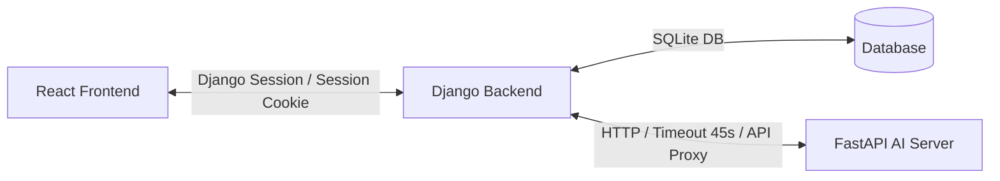

# 🏠 주택 청약 자가진단 및 AI 챗봇 백엔드 (Django Backend)

본 프로젝트는 React 프론트엔드와 내부 AI/RAG 서버(FastAPI) 사이에서 **회원 관리, 사용자 프로필 관리, 데이터 정합성 검증, API 호출 제한(Throttling) 및 보안 제어(소유권 격리)**를 담당하는 Django 기반 백엔드 시스템입니다.

---

## 🛠️ 시스템 아키텍처 개요

백엔드는 클라이언트의 직접적인 AI 연산 요청을 보안 및 안정성 측면에서 1차 차단하고, 가공 및 검증을 마친 데이터만 내부 AI 서버로 중계하는 **오케스트레이터 및 프록시(Proxy)** 역할을 수행합니다.



---

## ✨ 핵심 제공 기능

### 1. 🔑 인증 및 프로필 관리 (`accounts` 앱)
* **세션 기반 인증**: Django Session Cookie 방식을 채택하여 로그인 세션을 보존하며 CSRF 공격 방어를 기본 적용합니다.
* **프로필 검증**: 청약 자격 점수 계산을 위해 필요한 개인 프로필(청약 통장 가입일, 납입 횟수, 잔액, 거주지, 세대원 수, 무주택 여부 등)을 관리합니다.
  - *조건부 유효성 검증*: 결혼 여부(`marital_status`)가 기혼(`MARRIED`)일 때만 맞벌이 여부(`is_dual_income`) 항목을 필수로 수집하도록 유효성 검사를 구현했습니다.

### 2. 📊 청약 자가진단 및 어댑터 (`strategy` 앱)
* **진단 이력 관리**: 진단 실행 시 상태(`PENDING` ➡️ `RUNNING` ➡️ `SUCCEEDED` / `FAILED`)를 실시간으로 저장하며, 진단 시점의 입력 데이터 스냅샷을 DB에 함께 영구 적재합니다.
* **데이터 어댑터 패턴**: 4차 MVP 화면 표준 데이터 규격(유저 프로필)을 3차 RAG 연산 규격 포맷으로 변환하는 `ProfileAdapter` 클래스를 장착하였습니다.
* **소유권 격리 (`IsOwner`)**: 본인이 작성한 프로필 및 청약 진단 기록 단건 조회 시, 타인이 임의로 조회하거나 유출할 수 없도록 객체 레벨 권한 검사 정책을 수행합니다.

### 3. 📑 PDF 모집공고문 분석 중계 (Proxy)
* **파일 형식 검증**: PDF 이외의 형식 업로드 감지 시 백엔드 단에서 `PDF_INVALID_TYPE` 에러를 즉시 반환하여 내부 서버 부하를 최소화합니다.
* **MIME 파일 중계**: 업로드된 PDF 바이너리를 멀티파트 스트림으로 변환하여 FastAPI AI 분석 엔진으로 Proxy 전송합니다.

### 4. 💬 AI 챗봇 Proxy 및 보호막
* **챗봇 API 프록시**: RAG/LLM 연산을 Django 백엔드 내에 직접 작성하지 않고, FastAPI `/api/chat` 응답을 프론트엔드로 안전하게 포워딩합니다.
* **호출 제한 (Throttling)**: API 오남용 및 무분별한 과금을 방지하기 위해 회원 계정별 **분당 최대 60회 (`60/min`)** 호출 제약을 설정하여 안전을 확보합니다.
* **타임아웃 (45초) 보호**: AI 연산 지연으로 응답 대기가 길어질 때 커넥션 점유 마비를 예외 차단하기 위해 **최대 45초 타임아웃** 정책을 적용하고, 장애 발생 시 `FASTAPI_CONNECTION_FAILED` 에러 코드를 제공합니다.

---

## 🚦 주요 API 엔드포인트 명세

| 기능 분류 | HTTP 메서드 | 엔드포인트 URI | 인증 필수 여부 | 호출 제한 (Throttle) | 설명 |
| :--- | :---: | :--- | :---: | :---: | :--- |
| **인증** | `POST` | `/api/auth/signup` | 비인증 | - | 신규 회원가입 |
| **인증** | `POST` | `/api/auth/login` | 비인증 | - | 로그인 및 세션 생성 |
| **인증** | `POST` | `/api/auth/logout` | 인증 | - | 로그아웃 및 세션 파기 |
| **인증** | `GET` | `/api/auth/me` | 인증 | - | 현재 세션 사용자 정보 조회 |
| **인증** | `DELETE` | `/api/auth` | 인증 | - | 회원 탈퇴 및 DB 삭제 |
| **프로필** | `GET` | `/api/user/profile` | 인증 | - | 내 프로필 정보 조회 |
| **프로필** | `PUT` / `PATCH` | `/api/user/profile` | 인증 | - | 내 프로필 전체 수정 / 일부 수정 |
| **PDF 분석** | `POST` | `/api/pdf/analyze` | 인증 | - | 공고문 PDF 분석 의뢰 (FastAPI Proxy) |
| **공고 저장** | `POST` | `/api/user/announcement` | 인증 | - | 확인된 공고 내용 DB 개별 저장 |
| **공고 상세** | `GET` | `/api/user/announcement/<id>`| 인증 (소유자) | - | 저장한 특정 공고 상세 조회 |
| **청약 진단** | `POST` | `/api/strategy` | 인증 | - | 청약 자가진단 연산 수행 및 이력 저장 |
| **진단 목록** | `GET` | `/api/strategy/me` | 인증 | - | 내 청약 진단 히스토리 목록 조회 |
| **진단 상세** | `GET` | `/api/strategy/<id>` | 인증 (소유자) | - | 진단 결과 상세 내역 조회 |
| **AI 챗봇** | `POST` | `/api/chatbot` | 인증 | **60회 / 분** | RAG 청약 FAQ 질의응답 (FastAPI Proxy) |

---

## 📦 설치 및 로컬 개발 환경 실행 방법

### 1. 의존성 패키지 설치
Django 서버 실행을 위해 필요한 라이브러리를 설치합니다.
```powershell
# django_backend 디렉토리 내에서 실행
pip install -r requirements.txt
```

### 2. 데이터베이스 초기화 및 마이그레이션
```powershell
python manage.py makemigrations
python manage.py migrate
```

### 3. 로컬 서버 구동
서버는 기본적으로 `http://127.0.0.1:8000` 주소에서 시작됩니다.
```powershell
python manage.py runserver
```

---

## 🧪 테스트 및 품질 검증 방법

### 1. 자동화 유닛 테스트 실행
계정 회원가입부터 프로필 검증, PDF 바이너리 업로드 차단, 챗봇 Rate-Limiting(Throttling) 한계 검증을 포함한 **총 20개 테스트 스위트**를 실행합니다.
```powershell
python manage.py test
```

### 2. 사용자 시나리오 시뮬레이터 실행
실제 브라우저의 로그인 세션 유지 환경을 재현하여 회원가입부터 프로필 작성, 챗봇 질문 및 로그아웃까지 논스톱으로 시뮬레이션할 수 있는 스크립트입니다. (로컬 서버가 구동 중이어야 합니다.)
```powershell
python test_send.py
```

---

## 🚨 규격화된 커스텀 에러 코드 (Common Error Payload)
클라이언트가 예외 처리를 유연하게 할 수 있도록 모든 예외 상황 시 다음과 같이 공통 응답 봉투에 커스텀 에러 코드가 담겨 나갑니다.

* **`PROFILE_REQUIRED`**: 자가진단을 진행하기 전 프로필 등록이 선행되지 않은 경우
* **`PROFILE_REQUIRED_FIELDS_MISSING`**: 진단 실행 시점에 프로필에 누락된 필수 필드가 있는 경우
* **`PDF_INVALID_TYPE`**: PDF 확장자 또는 application/pdf 형식이 아닌 파일을 업로드한 경우
* **`FASTAPI_CONNECTION_FAILED`**: 내부 FastAPI AI 서버 연결 실패, 타임아웃(45초 초과), 또는 5xx 응답 수신 시
```json
{
  "data": null,
  "error": {
    "code": "FASTAPI_CONNECTION_FAILED",
    "message": "챗봇 서비스 호출에 실패했습니다: 챗봇 서버 응답이 없습니다.",
    "field_errors": null
  },
  "request_id": "7bf3b934-8c88-4680-bc40-19253457bbef"
}
```
