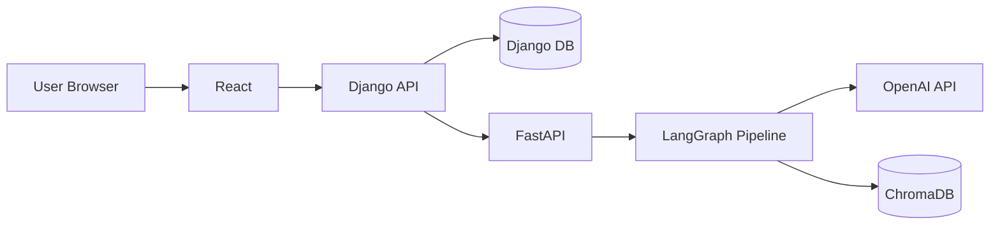

# version-1 0706 통합 현황 및 팀원 전달 메모

기준일: 2026-07-06
기준 브랜치: `version-1-integrate-0706`
대상 PR: `version-1` 병합 후보
목적: jihun 백엔드 개선, dongyoon_v1 Django 개선, eunjin/frontend 프론트 개선을 한 통합 흐름으로 묶고, 팀원이 현재 구조와 확인 방법을 빠르게 파악하게 한다.

## 1. 현재 통합 기준

현재 통합본은 프론트를 기준으로 백엔드를 맞춘 것이 아니라, **최신 FastAPI/Django/API 계약을 기준으로 React 화면을 맞춘 상태**다.

통합 순서:

```text
origin/version-1
  └─ jihun 백엔드 개선 반영 완료
      └─ version-1-api-contract 문서 기준 추가
          └─ dongyoon_v1 Django 로그인 throttle + Vite proxy 선반영
              └─ eunjin/frontend 프론트 개선 통합
```

핵심 판단:

- jihun 백엔드 개선은 이미 `version-1`에 병합되어 있었으므로 현재 백엔드 기준으로 사용했다.
- dongyoon_v1은 Django 로그인 throttle/test와 Vite proxy만 먼저 반영했다.
- eunjin/frontend는 UI/UX, AuthContext, mock 제거, MyPage, ChatbotPage, 결과 상세 개선을 통합했다.
- `ResultDetail.tsx`는 충돌이 있었고, API 계약 기준으로 수동 해결했다.

## 2. 전체 서비스 흐름



역할 분리:

| 영역 | 책임 |
|---|---|
| React | 화면, 입력, 로그인 상태 표시, 결과/챗봇 UI |
| Django | 인증, session cookie, 권한, 사용자 프로필/진단 이력 저장, FastAPI proxy |
| FastAPI | PDF 추출, LangGraph 진단, RAG/챗봇, LLM fallback |
| ChromaDB | RAG 검색용 collection 저장 |

## 3. 핵심 사용자 흐름

### 3.1 로그인과 보호 라우팅

```text
React AuthProvider
-> Django GET /api/auth/me
-> 로그인 상태 확인
-> 비로그인 사용자는 /login으로 이동
-> 로그인 후 /profile 또는 원래 요청 화면으로 이동
```

관련 파일:

- `frontend-react/src/app/auth/AuthContext.tsx`
- `frontend-react/src/app/components/Layout.tsx`
- `frontend-react/src/app/components/SiteHeader.tsx`
- `frontend-react/src/app/pages/Login.tsx`
- `django_backend/accounts/views.py`

### 3.2 전략 진단

```text
React POST /api/strategy
-> Django StrategyRunAPIView
-> FastAPI POST /api/profile
-> FastAPI POST /api/simulate
-> 필요 시 FastAPI POST /api/announcement
-> Django StrategyRun.result_payload 저장
-> React /results/:id 결과 상세 표시
```

관련 파일:

- `frontend-react/src/app/pages/StrategyRun.tsx`
- `frontend-react/src/app/pages/ResultDetail.tsx`
- `django_backend/strategy/views.py`
- `django_backend/strategy/services.py`
- `django_backend/strategy/serializers.py`
- `Backend/src/pipeline.py`

### 3.3 PDF 기반 진단

```text
React POST /api/pdf/analyze
-> Django PDFAnalyzeAPIView
-> FastAPI POST /api/pdf/analyze
-> combined_text 추출
-> React /strategy state로 전달
-> POST /api/strategy의 announcement_text로 사용
```

관련 파일:

- `frontend-react/src/app/pages/PdfAnalysis.tsx`
- `frontend-react/src/app/pages/StrategyRun.tsx`
- `django_backend/strategy/views.py`
- `Backend/app/routers/pdf_router.py`
- `Backend/app/services/pdf_service.py`

### 3.4 챗봇

```text
React POST /api/chatbot
-> Django ChatbotAPIView
-> FastAPI POST /api/chat
-> RAG graph 지연 초기화
-> answer/sources/session_id 반환
```

관련 파일:

- `frontend-react/src/app/components/ChatbotPanel.tsx`
- `frontend-react/src/app/pages/ChatbotPage.tsx`
- `django_backend/strategy/views.py`
- `Backend/app/routers/chat_router.py`
- `Backend/app/services/chat_service.py`

## 4. ResultDetail 통합 기준

`ResultDetail.tsx`는 이번 통합의 핵심 충돌 파일이었다.

수동 해결 기준:

- eunjin/frontend의 개선된 결과 상세 UI는 유지한다.
- Django/FastAPI 응답 계약에 맞는 필드 대응은 반드시 유지한다.
- 프론트가 백엔드 응답을 임의로 바꾸도록 요구하지 않는다.

유지한 필드 대응:

```text
chance -> competitiveness -> status -> score
missing_fields + missing_items
matched_items
source_refs
warnings
report.summary
report.finance
report.strategy
node5.agent_result
```

주의:

- FastAPI 내부는 `missing_items`를 주로 사용한다.
- Django 공개 응답 계약은 `missing_fields`를 사용한다.
- 통합 과도기에는 React가 둘 다 읽도록 했다.

## 5. 현재 검증 결과

```text
git diff --check: OK
Django manage.py check: OK
Django accounts + strategy tests: 26 passed
FastAPI app import: OK
React frontend tests: 7 passed
React production build: OK
ChromaDB collection count: []
```

ChromaDB 상태:

- 현재 worktree의 ChromaDB collection은 비어 있다.
- RAG/챗봇 실동작 확인 전 `build_all.py` 재실행이 필요하다.

```cmd
python -X utf8 Backend\src\preprocessing\build_all.py
python -c "import chromadb; c=chromadb.PersistentClient(path='Backend/src/preprocessing/chroma_db'); print(sorted([(x.name, x.count()) for x in c.list_collections()]))"
```

기대 collection:

```text
faq_chunks, guide_chunks, law_chunks, lh_guide_chunks, manual_chunks, web_faq_chunks
```

## 6. 현재 상황을 확인하는 방법

브랜치 받기:

```cmd
git fetch origin
git switch version-1-integrate-0706
```

의존성 갱신:

```cmd
pip install -r requirements.txt
pip install -r django_backend/requirements.txt
cd frontend-react
pnpm.cmd install
```

검증:

```cmd
python django_backend\manage.py check
python django_backend\manage.py test accounts strategy
python -c "import sys; sys.path.insert(0, 'Backend'); from main import app; print('fastapi import ok')"
cd frontend-react
pnpm.cmd test
pnpm.cmd run build
```

로컬 실행:

```cmd
python -m uvicorn main:app --app-dir Backend --reload --host 127.0.0.1 --port 8080
python django_backend\manage.py runserver 127.0.0.1:8000
cd frontend-react
pnpm.cmd dev -- --host 127.0.0.1 --port 5173
```

프론트 API 설정:

- 로컬 Vite dev에서는 `VITE_API_BASE_URL`을 비워둔다.
- 그러면 `frontend-react/vite.config.ts`의 `/api` proxy를 통해 Django로 요청된다.
- proxy를 쓰지 않는 환경에서만 `VITE_API_BASE_URL=http://127.0.0.1:8000`처럼 직접 지정한다.

## 7. 동윤님께 전달

동윤님, `dongyoon_v1`에서 올려주신 Django 로그인 throttle과 테스트를 통합본에 반영했습니다.

반영된 내용:

- `LoginRateThrottle` 추가
- `LoginAPIView`에 로그인 10회/min 제한 적용
- 로그인 throttle 테스트 추가
- 테스트 간 throttle cache 누적 방지를 위한 `cache.clear()` 추가
- Vite `/api` proxy 반영

검증 결과:

```text
Django accounts + strategy tests: 26 passed
Django manage.py check: OK
React build: OK
```

조정한 부분:

- `Home.tsx`, `Login.tsx`, `routes.tsx`에 있던 임시 프론트 흐름 테스트성 변경은 그대로 가져오지 않았습니다.
- 이유는 eunjin/frontend에 AuthContext 기반 로그인 유지, 보호 라우팅, mock 제거가 더 크게 들어와 있었기 때문입니다.
- 대신 Vite proxy는 살렸고, React client의 기본 API base URL을 빈 값으로 두어 로컬 개발 시 proxy가 실제로 동작하게 맞췄습니다.

확인해주시면 좋은 부분:

- 로그인 throttle 정책이 `10/min`이면 충분한지
- 로그인 실패뿐 아니라 성공 요청도 throttle 대상인 현재 정책이 의도와 맞는지
- 실제 브라우저에서 `/login -> /profile -> logout` 흐름이 session cookie 기준으로 기대대로 동작하는지

## 8. 은진님께 전달

은진님, `eunjin/frontend`의 프론트 개선사항을 통합본에 반영했습니다.

반영된 주요 내용:

- mock fixture fallback 제거
- Django API 직접 호출 중심 client 반영
- AuthContext 기반 로그인 상태 유지
- 보호 라우팅 적용
- MyPage 진단 기록 조회 화면 추가
- ChatbotPage 추가
- 로그인/회원가입 UI 개선
- Profile 조건부 입력 개선
- StrategyRun 중복 실행 방지/로딩 처리
- PdfAnalysis 업로드/로딩 처리 개선
- ResultDetail UI 개선
- 프론트 테스트 7개 추가
- 프론트 문서와 evidence 이미지 추가

수동 조정한 부분:

- `ResultDetail.tsx`에서 최신 FastAPI/Django 응답 계약을 기준으로 필드 매핑을 조정했습니다.
- 특히 `missing_items`와 `missing_fields`를 둘 다 읽도록 했습니다.
- `chance`, `competitiveness`, `status`, `score`도 순서대로 fallback 처리합니다.
- `report.finance`, `report.strategy`, `node5.agent_result`, `warnings`가 결과 화면에서 누락되지 않도록 유지했습니다.

추가로 조정한 부분:

- 로컬 개발에서는 Vite proxy를 쓰도록 `VITE_API_BASE_URL` 기본값을 빈 값으로 맞췄습니다.
- `frontend-react/.env.example`과 `frontend-react/README.md`도 같은 기준으로 수정했습니다.

확인해주시면 좋은 부분:

- `ResultDetail.tsx` 화면에서 공급유형 순위, 추가 확인 항목, 재무 분석, 상세 전략이 의도한 디자인대로 보이는지
- MyPage에서 `/api/strategy/me` 응답이 비어 있거나 실패할 때 사용자 안내가 충분한지
- 모바일 상단 탭과 챗봇 전용 화면이 실제 사용 흐름에서 자연스러운지

## 9. PM/팀 공통 공유 요약

```text
version-1-integrate-0706 브랜치에 0706 통합본을 올렸습니다.

포함 내용:
- jihun 백엔드 개선이 들어간 최신 version-1 기준 유지
- dongyoon_v1 로그인 throttle/test + Vite proxy 반영
- eunjin/frontend 프론트 개선 통합
- ResultDetail.tsx는 FastAPI/Django API 계약 기준으로 수동 병합

검증:
- Django check OK
- Django accounts/strategy 26 tests OK
- FastAPI import OK
- React tests 7개 OK
- React production build OK

주의:
ChromaDB collection은 현재 로컬 worktree에서 비어 있으므로 RAG/챗봇 실검증 전 build_all.py 재실행이 필요합니다.
```
