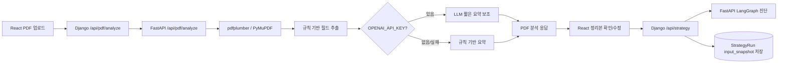
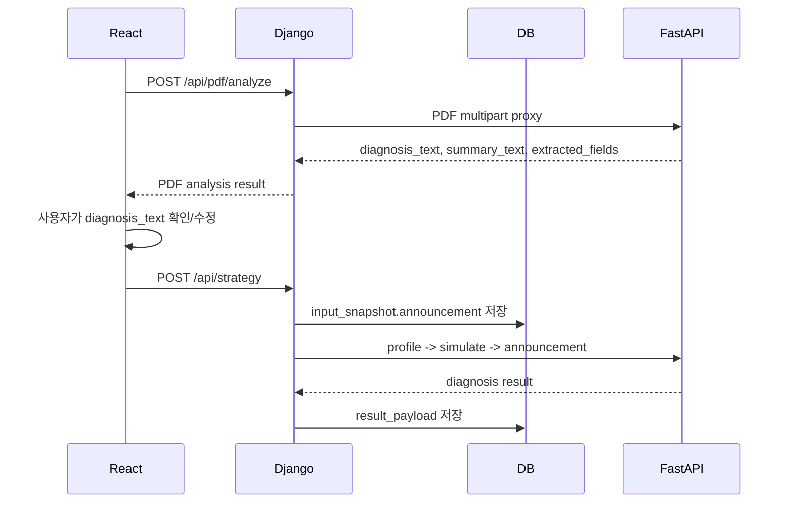

# PDF 분석 개선 현황

기준일: 2026-07-07  
작업 브랜치: `integrate-eunjin-v2-0707`  
목적: 청약홈/마이홈 아파트 모집공고 PDF를 전략 진단에 쓸 수 있는 입력값으로 정리하고, 사용자가 나중에 어떤 공고로 진단했는지 쉽게 확인하게 한다.

## 1. 핵심 요약

| 항목 | 기존 | 개선 후 |
|---|---|---|
| PDF 원본 | 저장하지 않음 | 저장하지 않음 유지 |
| 사용자에게 보여주는 내용 | raw 추출문에 가까운 `combined_text` | 짧은 핵심 요약 `summary_text` |
| 진단 입력 | 추출문 일부 + 표 일부 | 구조화된 `diagnosis_text` |
| 표 기반 핵심값 | LLM이 놓칠 수 있음 | 주택형/전용면적/공급금액 범위를 규칙 기반으로 먼저 추출 |
| 이력 추적 | 파일명, 입력 텍스트 중심 | `pdf_analysis_id`, `pdf_summary_text`, `pdf_extracted_fields` 저장 |
| 마이페이지 제목 | 공고 없는 진단/공고 진단 구분이 약함 | PDF 공고는 아파트명/공고명, 공고 없는 분석은 `청약 가능성 분석` |
| LLM 의존도 | raw 텍스트 정리에 의존 | 규칙 기반 추출 우선, LLM은 짧은 요약 보조 |

이번 개선의 핵심은 “공고문을 길게 요약”하는 것이 아니다.  
사용자에게는 공고 식별용 핵심 카드만 보여주고, 전략 진단에는 청약 가능성 판단에 필요한 필드를 구조적으로 넘기는 방향이다.

## 2. 서비스 흐름



## 3. PDF 분석 응답의 역할 분리

| 필드 | 용도 | 화면/저장 |
|---|---|---|
| `raw_preview` | 원문 추출 일부 확인용 | PDF 화면에서 접어서 표시 |
| `summary_text` | 사용자 이력/확인용 짧은 요약 | 마이페이지/결과 상세 확장 후보 |
| `diagnosis_text` | 전략 진단 입력용 구조화 텍스트 | React에서 수정 가능, `/api/strategy.announcement_text`로 전달 |
| `extracted_fields` | 공고명, 위치, 주택형, 공급금액, 일정 등 구조화 필드 | `input_snapshot.announcement.pdf_extracted_fields`로 저장 |
| `combined_text` | 하위 호환 필드 | 현재 `diagnosis_text`와 같은 값 |
| `summary_source` | `llm` 또는 `rule` | 정리 방식 표시 |

## 4. 저장 흐름



`POST /api/strategy`에 추가로 보존되는 PDF 메타데이터:

```json
{
  "announcement_text": "진단용 구조화 공고문",
  "input_method": "pdf",
  "source_filename": "notice.pdf",
  "pdf_analysis_id": "uuid",
  "pdf_summary_text": "사용자 확인용 짧은 요약",
  "pdf_extracted_fields": {
    "announcement_name": "공고명",
    "location": "공급 위치",
    "housing_types": [],
    "price_summary": {
      "min_krw": 1206000000,
      "max_krw": 1707000000
    }
  }
}
```

## 5. 실제 PDF 검증 결과

검증 파일:

```text
2026000153 동작 센트럴 동문 디 이스트 입주자모집공고문.pdf
```

추출 결과 요약:

| 항목 | 추출 결과 |
|---|---|
| 공고명 | 동작 센트럴 동문 디 이스트 입주자모집공고 |
| 공급 위치 | 서울특별시 동작구 상도동 363-10번지 일원 |
| 주택 유형 | 민영주택 |
| 규제지역 | 투기과열지구, 청약과열지역 |
| 모집공고일 | 2026.07.02 |
| 공급 규모 | 총 301세대, 일반분양 72세대, 특별공급 38세대 |
| 주택형 | 46, 51, 53, 56A, 56B, 58A, 58B, 58C, 59, 62 |
| 공급금액 | 약 12.06억~17.07억 |
| 특별공급 | 2026.07.13 |
| 1순위 | 2026.07.14~2026.07.15 |
| 2순위 | 2026.07.16 |
| 당첨자 발표 | 2026.07.23 |
| 재당첨 제한 | 10년 |
| 전매 제한 | 3년 |
| 거주의무 | 없음 |

사용자에게 보여줄 수 있는 짧은 요약 예시:

```text
[PDF 공고문 핵심 요약]
동작 센트럴 동문 디 이스트 입주자모집공고
서울특별시 동작구 상도동 363-10번지 일원
민영주택 · 투기과열지구, 청약과열지역
모집공고일 2026.07.02

공급: 총 301세대, 일반분양 72세대, 특별공급 38세대
주택형: 46~62형 (10개 주택형)
공급금액: 약 12.06억원~17.07억원
```

## 6. 주요 파일

| 파일 | 역할 |
|---|---|
| `Backend/app/services/pdf_service.py` | PDF 텍스트/표 추출, 핵심 필드 추출, 요약 생성 |
| `Backend/app/routers/pdf_router.py` | FastAPI PDF 분석 endpoint |
| `django_backend/strategy/views.py` | Django PDF proxy, 전략 진단 input_snapshot 저장 |
| `django_backend/strategy/serializers.py` | `pdf_summary_text`, `pdf_extracted_fields` 요청 검증 |
| `frontend-react/src/app/pages/PdfAnalysis.tsx` | PDF 업로드, 정리본 확인/수정 |
| `frontend-react/src/app/pages/StrategyRun.tsx` | PDF 정리본과 메타데이터를 전략 진단으로 전달 |
| `frontend-react/src/app/api/client.ts` | PDF/전략 API 타입 |
| `frontend-react/src/app/utils/announcementPresentation.ts` | 마이페이지/결과 상세의 공고 제목과 기본정보 표시 |

## 7. 환경 변수

루트 `.env`:

```dotenv
OPENAI_API_KEY=sk-...
FASTAPI_API_URL=http://127.0.0.1:8080
FASTAPI_PROFILE_TIMEOUT=10
FASTAPI_SIMULATE_TIMEOUT=30
FASTAPI_CHATBOT_TIMEOUT=30
FASTAPI_ANNOUNCEMENT_TIMEOUT=90
FASTAPI_PDF_TIMEOUT=90
```

`OPENAI_API_KEY`가 없거나 LLM 요약이 실패하면 PDF 분석은 중단되지 않고 규칙 기반 요약으로 진행한다.

React 로컬 개발:

```dotenv
VITE_API_BASE_URL=
```

## 8. 검증 명령과 결과

검증 명령:

```cmd
.\.venv\Scripts\python.exe -c "import sys; sys.path.insert(0, 'Backend'); from main import app; print('fastapi import ok')"
.\.venv\Scripts\python.exe django_backend\manage.py check
.\.venv\Scripts\python.exe django_backend\manage.py test accounts strategy
cd frontend-react
corepack pnpm test
corepack pnpm run build
```

확인 결과:

```text
실제 PDF analyze 직접 호출 OK
FastAPI import OK
Django manage.py check OK
Django accounts strategy tests 27 passed
React tests 7 passed
React production build OK
```

## 9. 남은 과제

| 우선순위 | 과제 | 메모 |
|---:|---|---|
| 1 | 마이페이지/결과 상세에 `pdf_summary_text` 표시 | 이력에서 공고 식별성을 높임 |
| 2 | 다른 청약홈/마이홈 PDF 샘플 추가 검증 | 표 구조가 다른 PDF 대응 확인 |
| 3 | `extracted_fields` 기반 `announcement_confirmed` 보강 검토 | 현재는 마이페이지 표시에서 우선 사용 |
| 4 | PDF 분석 시간이 긴 케이스 측정 | LLM 사용/미사용, 페이지 수별 비교 |
| 5 | env/README/docs 최신화 유지 | timeout 변수명과 API 계약 동기화 |

## 10. 참고 문서

- [PDF 개선 작업 추적](../traces/260707_PDF_IMPROVEMENT_TRACKING.md)
- [API 응답 계약](260706_VERSION1_API_RESPONSE_CONTRACT.md)
- [version-1 API 응답 계약](260706_VERSION1_API_RESPONSE_CONTRACT.md)
- [현재 구조와 정상화 요약](VERSION1_CURRENT_ARCHITECTURE.md)
