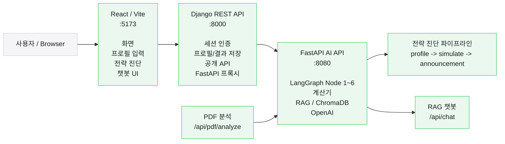
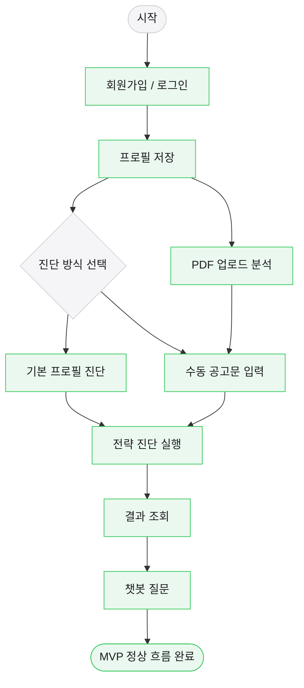

# 현재 통합 현황

기준일: 2026-07-03
기준 브랜치: `final-debug-share`
목적: PM/팀원이 이 파일만 보고 현재 구조, 실행 가능 상태, 미완료 과제, 주요 파일 흐름을 빠르게 파악하도록 정리한다.

## 0. 한눈에 보기

| 구분 | 현재 상태 | 메모 |
|---|---|---|
| 화면 | React/Vite 사용 | 기존 Streamlit `Frontend/`는 제거됨 |
| 공개 API | Django REST API | 브라우저는 FastAPI를 직접 호출하지 않음 |
| AI/RAG | 기존 FastAPI/LangGraph/RAG 유지 | 3차 핵심 로직은 최대한 보존 |
| 정상 MVP 흐름 | 가능 | 회원가입/프로필/전략진단/결과/챗봇 기준 |
| PDF 분석 | 추출 MVP 완료 | 원본 저장 없이 텍스트/표 추출 후 전략 진단 입력으로 전달 |
| 배포 | 미완료 | Docker/CI/AWS 구성 필요 |
| 운영 보안 | 미완료 | 현재 CSRF exempt는 로컬 통합용 |

현재 핵심 흐름:

```text
React (:5173)
  -> Django REST API (:8000)
       -> FastAPI AI API (:8080)
            -> LangGraph / 계산기 / RAG / ChromaDB / OpenAI
```



## 1. 실행 검증 결과

2026-07-02 기준 로컬에서 다음을 확인했다.

| 항목 | 결과 | 확인 내용 |
|---|---|---|
| Python 문법 | 통과 | `Backend`, `django_backend` 전체 AST parse 성공 |
| Django 설정 | 통과 | `manage.py check` 성공 |
| Django 테스트 | 통과 | `django_backend` 기준 22개 테스트 성공 |
| FastAPI import | 통과 | `from main import app` 성공, 앱 title 확인 |
| FastAPI HTTP | 통과 | `GET /health` -> `{"status":"ok"}` |
| React build | 통과 | `pnpm run build` 성공 |
| React dev server | 통과 | 호환 Node PATH 적용 후 `GET /` -> HTTP 200 |

주의:

- React/Vite는 기본 PATH의 Node로 실행하면 `crypto.getRandomValues is not a function` 오류가 날 수 있다.
- Node 20 이상이 PATH에 잡혀 있으면 build/dev가 통과한다. 구버전 Node가 먼저 잡히면 Vite 실행 오류가 날 수 있다.

```powershell
node --version
```

- FastAPI/RAG requirements는 문서상 Python 3.10 기준 검증이다. 현재 확인은 이 PC의 Python 3.13 `.venv`에서도 import/health까지는 통과했다.
- 실제 전략 진단 end-to-end는 OpenAI API key, ChromaDB 상태, LLM 응답 시간이 영향을 준다. 이번 확인은 서버 기동/HTTP health/build/test 중심이다.

## 2. 핵심 원칙

- 3차 프로젝트의 FastAPI, LangGraph, 계산기, RAG, ChromaDB 흐름은 핵심 AI 자산으로 유지한다.
- 브라우저의 공개 API 경계는 Django다. React는 FastAPI를 직접 호출하지 않는다.
- React는 4차 공개 API 필드만 사용한다.
- 4차 필드와 3차 FastAPI 내부 필드 변환은 Django `ProfileAdapter`가 담당한다.
- `null`, `0`, `false`, 필드 누락은 서로 다른 값으로 취급한다.
- 현재 PDF MVP는 공고문 텍스트/표 추출 후 기존 수동 공고문 입력 경로에 연결하는 방식이다.

## 3. 사용자 기준 정상 흐름

```text
회원가입/로그인
  -> 프로필 저장
  -> 기본 프로필 진단 또는 수동 공고문 입력
  -> 전략 진단 실행
  -> 결과 조회
  -> 챗봇 질문
```



PDF 업로드 화면은 원본 파일을 저장하지 않고 추출된 `combined_text`를 사용자가 확인한 뒤 전략 진단 입력으로 넘긴다.

## 4. 기능별 상태

| 기능 | 상태 | 완료 기준/비고 |
|---|---|---|
| 회원가입/로그인/로그아웃 | 완료 | Django session cookie 사용 |
| 프로필 조회/저장/수정 | 완료 | 사용자별 Profile 저장 |
| 기본 프로필 전략 진단 | 완료 | 공고문 없이 Node 6까지 진행 |
| 수동 공고문 전략 진단 | 완료 | Django가 FastAPI를 순차 호출 |
| 결과 목록/상세 조회 | 완료 | StrategyRun 저장 결과 조회 |
| RAG 챗봇 | 완료 | React -> Django -> FastAPI `/api/chat` |
| PDF 업로드 분석 | 완료 | pdfplumber/PyMuPDF로 텍스트·표 추출, 원본 저장 없음 |
| Result 응답 단일화 | 미완료 | 현재 React가 과도기 응답 형태를 둘 다 처리 |
| 표준 CSRF | 미완료 | 배포 전 CSRF token 구조 필요 |
| Docker/CI/AWS | 미완료 | 새 clone 기준 재현 자동화 필요 |

## 5. 요청 흐름

### 5.1 인증

```text
Login.tsx
  -> client.ts POST /api/auth/signup 또는 /api/auth/login
  -> django_backend/accounts/urls.py
  -> django_backend/accounts/views.py
  -> Django session 발급
```

입력 예시:

```json
{
  "email": "user@example.com",
  "password": "password"
}
```

### 5.2 프로필 저장

```text
Profile.tsx
  -> client.ts PUT/PATCH /api/user/profile
  -> accounts.views ProfileAPIView
  -> accounts.serializers.ProfileSerializer
  -> accounts.models.Profile 저장
```

프로필은 4차 공개 필드명으로 저장한다.

예:

```text
bankbook_payment_count
bankbook_balance_krw
residence_region
is_homeless
household_member_count
```

### 5.3 전략 진단

```text
StrategyRun.tsx
  -> client.ts POST /api/strategy
  -> strategy.views.StrategyRunAPIView
  -> ProfileSerializer 필수 프로필 검증
  -> strategy.adapters.ProfileAdapter.to_3rd_spec
  -> strategy.services.FastAPIClient.run_diagnosis
  -> FastAPI /api/profile
  -> FastAPI /api/simulate
  -> 공고문이 있으면 FastAPI /api/announcement
  -> StrategyRun.result_payload 저장
  -> ResultDetail.tsx 표시
```

공고문이 있을 때 실제 호출 순서:

```text
profile -> simulate(True) -> announcement
```

공고문이 없을 때 실제 호출 순서:

```text
profile -> simulate(False)
```

### 5.4 챗봇

```text
ChatbotPanel.tsx
  -> client.ts POST /api/chatbot
  -> strategy.views.ChatbotAPIView
  -> strategy.services.FastAPIClient.call_chatbot
  -> FastAPI /api/chat
  -> Backend/src/rag/chat_graph.py
  -> 답변과 sources 반환
```

### 5.5 PDF 분석

```text
PdfAnalysis.tsx
  -> client.ts POST /api/pdf/analyze
  -> strategy.views.PDFAnalyzeAPIView
  -> strategy.services.FastAPIClient.proxy_pdf_analysis
  -> FastAPI /api/pdf/analyze
  -> pdf_service.analyze_pdf_bytes
  -> combined_text를 StrategyRun.tsx announcement_text로 전달
```

현재 PDF MVP는 구조화된 청약 조건 자동 확정이 아니라 텍스트/표 추출과 사용자 확인 후 전략 진단 입력 연결에 집중한다.

## 6. 주요 파일 지도

### React

| 파일 | 역할 |
|---|---|
| `frontend-react/src/main.tsx` | React 앱 진입점 |
| `frontend-react/src/app/App.tsx` | Layout과 Router 연결 |
| `frontend-react/src/app/routes.tsx` | URL과 page component 매핑 |
| `frontend-react/src/app/api/client.ts` | Django 공개 API 호출 공통 client |
| `frontend-react/src/app/pages/Login.tsx` | 회원가입/로그인 화면 |
| `frontend-react/src/app/pages/Profile.tsx` | 프로필 입력/수정 화면 |
| `frontend-react/src/app/pages/StrategyRun.tsx` | 기본/수동 공고문 전략 진단 실행 |
| `frontend-react/src/app/pages/ResultDetail.tsx` | 전략 진단 결과 표시 |
| `frontend-react/src/app/pages/PdfAnalysis.tsx` | PDF 업로드, 추출 미리보기, 전략 진단 입력 전달 |
| `frontend-react/src/app/components/ChatbotPanel.tsx` | RAG 챗봇 UI |

### Django

| 파일 | 역할 |
|---|---|
| `django_backend/config/settings.py` | Django, CORS, DRF, FastAPI URL 설정 |
| `django_backend/config/urls.py` | `/api/` 요청을 accounts/strategy로 연결 |
| `django_backend/common/renderers.py` | `{data, error, request_id}` envelope 응답 생성 |
| `django_backend/common/exceptions.py` | 예외를 공통 오류 형식으로 변환 |
| `django_backend/common/authentication.py` | 로컬 통합용 CSRF exempt session auth |
| `django_backend/accounts/models.py` | User/Profile 모델 |
| `django_backend/accounts/serializers.py` | 인증/프로필 요청 검증 |
| `django_backend/accounts/views.py` | 인증/프로필 API 처리 |
| `django_backend/strategy/models.py` | AnnouncementInput, StrategyRun 저장 |
| `django_backend/strategy/serializers.py` | 전략/공고/챗봇 요청 검증 |
| `django_backend/strategy/adapters.py` | 4차 Profile -> 3차 FastAPI schema 변환 |
| `django_backend/strategy/services.py` | FastAPI 내부 API 호출 client |
| `django_backend/strategy/views.py` | 전략 진단, PDF proxy, 챗봇 proxy 처리 |

### FastAPI/RAG

| 파일 | 역할 |
|---|---|
| `Backend/main.py` | FastAPI 앱 진입점 |
| `Backend/app/routers/app_routers.py` | 하위 router 통합 |
| `Backend/app/routers/profile.py` | `/api/profile`, Node 1~2 시작 |
| `Backend/app/routers/simulate_router.py` | `/api/simulate`, 기본/상세 분기 |
| `Backend/app/routers/announcement_router.py` | `/api/announcement`, 공고문 반영 |
| `Backend/app/routers/chat_router.py` | `/api/chat`, RAG 챗봇 |
| `Backend/app/routers/pdf_router.py` | `/api/pdf/analyze`, PDF 업로드 추출 |
| `Backend/app/services/pdf_service.py` | pdfplumber/PyMuPDF 기반 텍스트·표 추출 |
| `Backend/app/services/*_service.py` | router와 pipeline/RAG 연결 |
| `Backend/src/pipeline.py` | LangGraph Node 1~6 전략 진단 파이프라인 |
| `Backend/src/engine/node*.py` | 청약 계산/추천/리포트 단계 |
| `Backend/src/rag/chat_graph.py` | RAG 챗봇 graph 구성 |
| `Backend/src/preprocessing/build_all.py` | RAG 문서 전처리와 ChromaDB 재생성 |

## 7. 다음 작업 우선순위

| 우선순위 | 작업 | 이유 |
|---:|---|---|
| 1 | Result 응답 adapter 단일화 | React가 과도기 응답 형태를 둘 다 처리 중 |
| 2 | PDF 추출 결과 구조화 고도화 | 현재는 텍스트/표 추출 MVP이며 필드 자동 확정은 후속 |
| 3 | 표준 CSRF 적용 | 운영 배포 전 필수 보안 작업 |
| 4 | Node/Python 버전 고정 | 팀원별 실행 오류 감소 |
| 5 | Docker Compose 구성 | React/Django/FastAPI/환경변수 재현성 확보 |
| 6 | 새 clone 기준 통합 QA | 배포 전 팀 공통 검증 |

## 8. 같이 볼 문서

| 목적 | 문서 |
|---|---|
| MVP 범위/원칙 | `docs/current/PROJECT_SPEC.md` |
| API 입출력 계약 | `docs/current/API_CONTRACT.md` |
| 실행 명령 | `README.md`, `docs/current/VERSION1_INTEGRATION_HANDOFF_2026_07_06.md` |
| 팀 작업 규칙 | `docs/guides/TEAM_GUIDE.md` |
| 변경 이력 | `docs/traces/CHANGELOG.md` |


