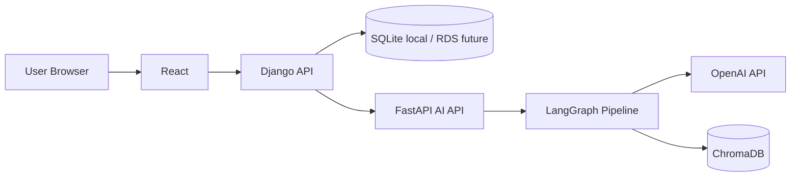
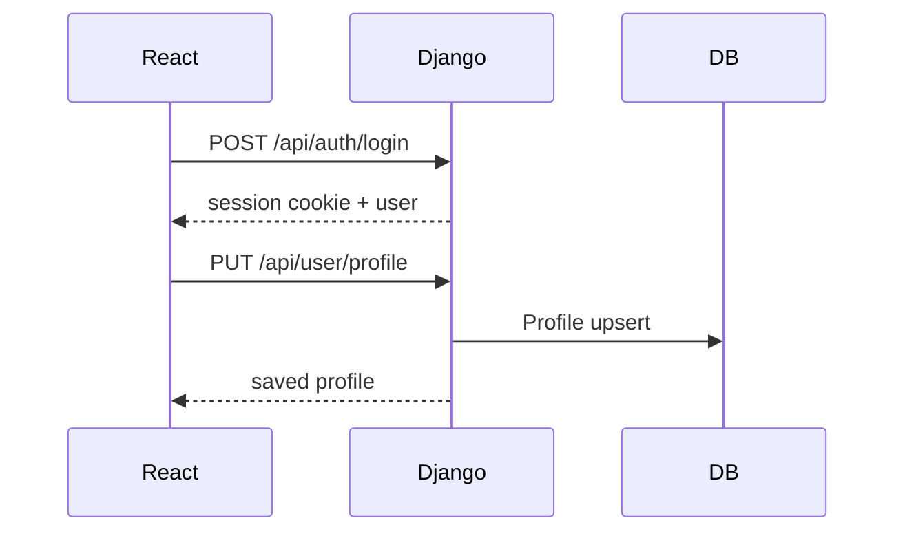
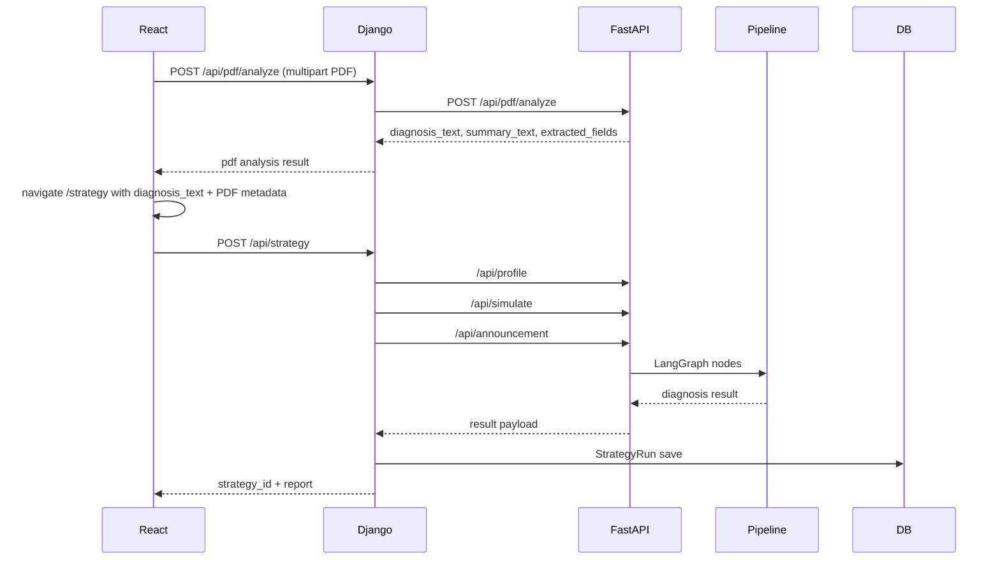
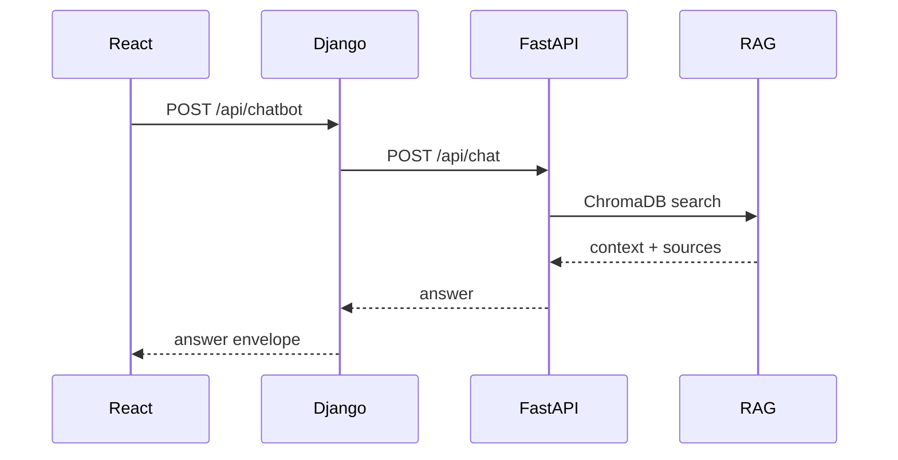

# version-1 현재 구조와 정상화 요약

이 문서는 `version-1` 브랜치를 주말 개발 기준으로 사용하기 위해 정상화한 뒤의 상태를 설명한다. 프로젝트에 처음 들어온 사람도 이 문서만 읽으면 서비스 흐름, 주요 파일, API 입출력, 남은 주의사항을 파악할 수 있게 하는 것이 목적이다.

## 1. version-1에서 달라진 핵심

`version-1`은 기존 `final` 흐름에 여러 팀원의 작업이 합쳐진 통합 브랜치다.

| 항목 | 바뀐 이유 | 현재 상태 |
|---|---|---|
| PDF 분석 | 청약홈/마이홈 모집공고 PDF를 눈에 보이는 성과로 연결하기 위해 추가 | PDF 업로드 → 텍스트/표 추출 → 전략 진단 입력 전달 가능 |
| RAG fallback | ChromaDB 일부 collection query 실패가 전체 전략 진단 500으로 번지는 문제 방지 | 검색 실패 시 `found=False`로 내려 전체 진단은 계속 진행 |
| FastAPI `.env` 로드 | `.env`에 OpenAI key가 있어도 app import 시점에 읽히지 않는 문제 방지 | `Backend/main.py`에서 router import 전에 `load_dotenv()` 호출 |
| 인증 정책 | 더미 로그인 대신 실제 로그인/세션 흐름으로 전환 | Django API는 인증 사용자 기준으로 동작 |
| 회원가입 보강 | 이메일 중복/약한 비밀번호/가입 남용 방지 | 이메일 정규화, 비밀번호 검증, signup throttle 적용 |
| timeout 분리 | profile/simulate/chat/announcement/pdf 호출 시간이 서로 다름 | Django FastAPI client가 API별 timeout 사용 |
| 결과 응답 정리 | FastAPI 내부 node 구조가 React에 그대로 노출되는 문제 완화 | `StrategyRunSerializer`에서 결과 표시용 형태로 adapter 역할 수행 |
| React 랜딩/UI | 서비스 첫인상과 사용자 흐름 보강 | `/` 랜딩 페이지, 진단 화면 UI, PDF 진입 경로 정리 |

## 2. 정상화에서 바로잡은 항목

`version-1` 병합 직후에는 몇 가지 깨진 지점이 있었다. 정상화 브랜치에서는 다음을 수정했다.

| 파일 | 문제 | 조치 |
|---|---|---|
| `frontend-react/src/app/components/Layout.tsx` | `useEffect`, `useState`, `useNavigate` import 누락 | React hook/router import 복구 |
| `frontend-react/src/app/components/Layout.tsx` | PDF 기능이 구현됐는데 nav에는 `PDF 분석 · 준비 중`으로 표시 | `/pdf`로 이동하는 정식 `PDF 분석` 메뉴 추가 |
| `frontend-react/src/app/pages/StrategyRun.tsx` | 사용하는 lucide icon import 누락 | `Pencil`, `MapPin`, `Home`, `Timer`, `Check` import 추가 |
| `frontend-react/src/app/pages/StrategyRun.tsx` | checkbox JSX 구조가 merge 중 깨짐 | label/input/check icon 구조 복구 |
| `frontend-react/src/app/pages/StrategyRun.tsx` | 전략 진단 화면에서 PDF 화면으로 가는 버튼이 사라짐 | `PDF 파일로 분석하기` 버튼 복구 |
| `django_backend/accounts/tests.py` | DummyLoginMiddleware 제거 후 기존 테스트가 403으로 실패 | 명시 인증 사용자 기준 테스트로 변경 |
| `django_backend/strategy/tests.py` | PDF 미지원 테스트가 남아 현재 구현과 충돌 | PDF proxy 성공 테스트로 변경 |

## 3. 전체 서비스 구조



역할 분리는 다음과 같다.

- React는 화면, 입력, 결과 표시를 담당한다.
- Django는 인증, 세션, 사용자 데이터, 전략 실행 이력, FastAPI proxy를 담당한다.
- FastAPI는 LLM/RAG/청약 진단 파이프라인과 PDF 추출을 담당한다.
- ChromaDB는 RAG 검색용 벡터 DB다.

## 4. 주요 사용자 흐름

### 4.1 로그인과 프로필 저장



관련 파일:

- `frontend-react/src/app/pages/Login.tsx`
- `frontend-react/src/app/pages/Profile.tsx`
- `frontend-react/src/app/api/client.ts`
- `django_backend/accounts/views.py`
- `django_backend/accounts/serializers.py`
- `django_backend/accounts/models.py`

### 4.2 PDF 분석 후 전략 진단



관련 파일:

- `frontend-react/src/app/pages/PdfAnalysis.tsx`
- `frontend-react/src/app/pages/StrategyRun.tsx`
- `django_backend/strategy/views.py`
- `django_backend/strategy/services.py`
- `Backend/app/routers/pdf_router.py`
- `Backend/app/services/pdf_service.py`
- `Backend/app/routers/announcement_router.py`
- `Backend/src/pipeline.py`

### 4.3 기본 전략 진단

공고문 없이 프로필만으로 기본 자격을 확인하는 흐름이다.

```text
React /strategy
-> Django POST /api/strategy profile_only=true
-> FastAPI /api/profile
-> FastAPI /api/simulate simulate=false
-> Django StrategyRun 저장
-> React 결과 화면 이동
```

### 4.4 챗봇



관련 파일:

- `frontend-react/src/app/components/ChatbotPanel.tsx`
- `django_backend/strategy/views.py`
- `django_backend/strategy/services.py`
- `Backend/app/routers/chat_router.py`
- `Backend/src/rag/chat_graph.py`
- `Backend/src/rag/retriever.py`

## 5. API 입출력 흐름

### React가 직접 호출하는 Django API

| Method | Endpoint | 목적 |
|---|---|---|
| `POST` | `/api/auth/signup` | 회원가입 |
| `POST` | `/api/auth/login` | 로그인 |
| `POST` | `/api/auth/logout` | 로그아웃 |
| `GET` | `/api/auth/me` | 현재 로그인 사용자 조회 |
| `GET` / `PUT` / `PATCH` | `/api/user/profile` | 프로필 조회/저장 |
| `POST` | `/api/pdf/analyze` | PDF 분석 proxy |
| `POST` | `/api/strategy` | 전략 진단 실행 |
| `GET` | `/api/strategy/me` | 내 진단 이력 |
| `GET` | `/api/strategy/:id` | 진단 상세 |
| `POST` | `/api/chatbot` | 챗봇 질문 |

### Django가 내부 호출하는 FastAPI API

| Method | Endpoint | 목적 |
|---|---|---|
| `GET` | `/health` | FastAPI 상태 확인 |
| `POST` | `/api/profile` | 3차 파이프라인용 프로필 입력 |
| `POST` | `/api/simulate` | 기본 진단 또는 공고 진단 분기 |
| `POST` | `/api/announcement` | 공고문 기반 상세 진단 |
| `POST` | `/api/pdf/analyze` | PDF 텍스트/표 추출 |
| `POST` | `/api/chat` | RAG 챗봇 응답 |

## 6. 주요 파일 구조

```text
version-1
├─ Backend/
│  ├─ main.py
│  ├─ app/
│  │  ├─ routers/
│  │  │  ├─ app_routers.py
│  │  │  ├─ pdf_router.py
│  │  │  ├─ profile.py
│  │  │  ├─ simulate_router.py
│  │  │  ├─ announcement_router.py
│  │  │  └─ chat_router.py
│  │  └─ services/
│  │     ├─ pdf_service.py
│  │     ├─ profile_service.py
│  │     ├─ simulate_service.py
│  │     ├─ announcement_service.py
│  │     └─ chat_service.py
│  └─ src/
│     ├─ pipeline.py
│     ├─ engine/
│     ├─ rag/
│     └─ preprocessing/chroma_db/
├─ django_backend/
│  ├─ accounts/
│  ├─ strategy/
│  ├─ common/
│  └─ config/
├─ frontend-react/
│  ├─ src/app/api/client.ts
│  ├─ src/app/components/
│  ├─ src/app/pages/
│  └─ src/app/routes.tsx
├─ docs/
├─ requirements.txt
└─ requirements-dev.txt
```

## 7. 실행 체크포인트

백엔드 검증:

```cmd
python django_backend\manage.py check
python django_backend\manage.py test accounts strategy
python -c "import sys; sys.path.insert(0, 'Backend'); from main import app; print('fastapi import ok')"
```

ChromaDB 재구축:

```cmd
python -X utf8 Backend\src\preprocessing\build_all.py
python -c "import chromadb; c=chromadb.PersistentClient(path='Backend/src/preprocessing/chroma_db'); print(sorted([(x.name, x.count()) for x in c.list_collections()]))"
```

기대 collection:

```text
faq_chunks, guide_chunks, law_chunks, lh_guide_chunks, manual_chunks, web_faq_chunks
```

주의: ChromaDB 구축은 OpenAI embedding API를 호출하므로 `.env`의 `OPENAI_API_KEY`, 네트워크, 사용량 제한이 모두 필요하다. `Backend/src/preprocessing/chroma_db/`는 로컬 산출물이므로 Git에 포함하지 않는다.

FastAPI:

```cmd
python -m uvicorn main:app --app-dir Backend --reload --host 127.0.0.1 --port 8080
```

Django:

```cmd
python django_backend\manage.py migrate
python django_backend\manage.py runserver 127.0.0.1:8000
```

React:

```cmd
cd frontend-react
pnpm install
pnpm run dev --host 127.0.0.1
```

주의:

- React/Vite 6은 Node 20 이상을 권장한다.
- `localhost`와 `127.0.0.1`을 섞으면 세션 쿠키가 깨질 수 있으므로 `127.0.0.1` 기준으로 통일한다.
- `.env`, `.venv`, `db.sqlite3`, `node_modules`, `dist`, ChromaDB 산출물은 Git에 올리지 않는다.

## 8. 현재 검증 결과

정상화 브랜치에서 확인한 결과:

```text
Django manage.py check: OK
Django accounts + strategy tests: 25 passed
FastAPI app import: OK
React pnpm install: OK
React pnpm run build: OK
ChromaDB build script/data path check: OK
ChromaDB local rebuild in this worktree: NOT RUN
```

React build 검증 환경:

- Node `v22.23.1`
- npm `10.9.8`
- pnpm `11.9.0`
- Vite production build 성공

ChromaDB 확인:

- `Backend/data` 원본 문서 존재 확인
- `Backend/src/preprocessing/build_all.py`가 `Backend/data`에서 원본 문서를 읽도록 경로 확인
- 현재 worktree의 `chroma_db`는 Git ignored 로컬 산출물이며, collection은 빌드 전 `[]` 상태였다
- Codex 환경에서는 OpenAI embedding API 네트워크 실행이 사용량 제한으로 승인되지 않아 재구축을 완료하지 못했다
- 팀원/PM 전달 시에는 위 ChromaDB 재구축 명령을 실행해 6개 collection count를 확인해야 한다

## 9. 남은 과제

- PDF 추출 내용이 최종 리포트에 얼마나 반영되는지 더 명확히 표시
- 공고명, 지역, 공급유형, 면적, 분양가, 접수일정 구조화
- 마이페이지에서 사용자별 진단 이력 보기 강화
- Docker Compose 작성
- PostgreSQL/RDS 전환 계획
- 배포용 Nginx/Gunicorn/FastAPI 구성
- 발표/평가 문서용 시스템 구성도 정리
