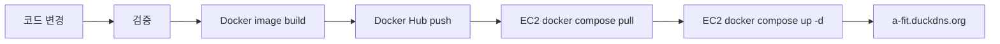
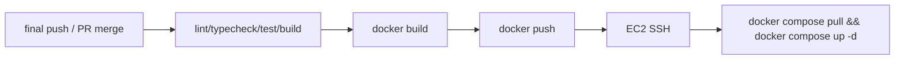

# Docker/AWS/CI-CD 배포 최종 정리

| 항목 | 내용 |
|---|---|
| 프로젝트 | A-FIT 청약 진단 서비스 |
| 작성일 | 2026-07-09 |
| 문서 상태 | 최종 제출본 |
| 배포 URL | `http://a-fit.duckdns.org/` |
| 운영 서버 | AWS EC2 `43.201.113.124` |
| 이미지 저장소 | Docker Hub `dongyoon99/*` |

## 1. 배포 흐름

최종 배포는 EC2 서버에서 직접 빌드하지 않고, 빌드된 이미지를 Docker Hub에 올린 뒤 EC2가 최신 이미지를 내려받아 컨테이너를 교체하는 방식이다. 이 방식은 EC2 프리티어 환경에서 빌드 중 메모리 부족이 발생하는 문제를 줄인다.



## 2. 서비스 이미지

| 서비스 | 이미지 | 역할 |
|---|---|---|
| frontend | `dongyoon99/frontend-react:latest` | React build 결과를 Nginx로 제공, `/api` 프록시 |
| django-backend | `dongyoon99/django-backend:latest` | 인증, 세션, 프로필, 진단 이력, FastAPI proxy |
| fastapi-backend | `dongyoon99/fastapi-backend:latest` | LangGraph/RAG/PDF/LLM 처리 |

## 3. EC2 운영 명령

```bash
cd ~/app
docker compose pull
docker compose up -d
docker ps
docker compose logs --tail=100
```

운영 서버에서는 HTTP 80 포트로 frontend Nginx 컨테이너에 인입한다. Django와 FastAPI는 Docker network 내부 서비스명으로 통신한다.

운영 환경 변수 파일은 EC2의 `~/app/runtime.env`로 생성한다. Compose의 기본 `.env` 자동 치환 과정에서 secret 값의 `$` 문자가 깨질 수 있어, 배포 단계에서는 기존 `~/app/.env`를 제거하고 `runtime.env`를 명시적으로 사용한다.

Nginx는 다음 경로를 Django 컨테이너로 프록시한다.

| 경로 | 프록시 대상 |
|---|---|
| `/api/` | `http://django-backend:8000/api/` |
| `/admin/` | `http://django-backend:8000/admin/` |
| `/static/admin/` | `http://django-backend:8000/static/admin/` |

현재 운영은 HTTP 기준이므로 `DJANGO_SESSION_COOKIE_SECURE=false`, `DJANGO_CSRF_COOKIE_SECURE=false`로 둔다. HTTPS 적용 시 두 값을 `true`로 전환한다.

## 4. GitHub Actions CI/CD

최종 CI/CD 기준은 GitHub Actions에서 검증, 이미지 빌드, Docker Hub push, EC2 배포를 자동화하는 것이다. 현재 워크플로 파일은 `.github/workflows/deploy.yml`로 구성하였다.



필요한 secret은 GitHub 저장소 설정에서 관리한다.

| Secret | 용도 |
|---|---|
| `DOCKERHUB_USERNAME` | Docker Hub 계정 |
| `DOCKERHUB_TOKEN` | Docker Hub access token |
| `EC2_HOST` | EC2 host 또는 IP |
| `EC2_USER` | SSH 사용자, 예: `ubuntu` |
| `EC2_SSH_KEY` | EC2 접속 private key |
| `OPENAI_API_KEY`, `DJANGO_SECRET_KEY` 등 | 운영 환경 변수 |

워크플로 동작 기준은 다음과 같다.

| 이벤트 | 동작 |
|---|---|
| `pull_request -> final` | Python/Django/Frontend 검증만 수행 |
| `push -> final` | 검증 후 Docker 이미지 빌드/푸시 및 EC2 배포 |
| `workflow_dispatch` | GitHub Actions 화면에서 수동 실행 |

Secret 등록과 오류 대응 절차는 [docs/guides/GITHUB_ACTIONS_CICD_SETUP.md](../guides/GITHUB_ACTIONS_CICD_SETUP.md)를 참고한다.

## 5. 운영상 남은 고도화

- HTTPS 적용
- SQLite volume에서 PostgreSQL/RDS로 전환
- 정적/미디어 파일 S3 또는 CloudFront 분리
- 배포 후 smoke test 자동화
- PDF/RAG 품질 회귀 테스트 자동화
