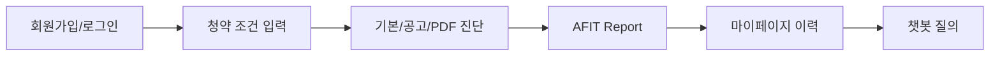
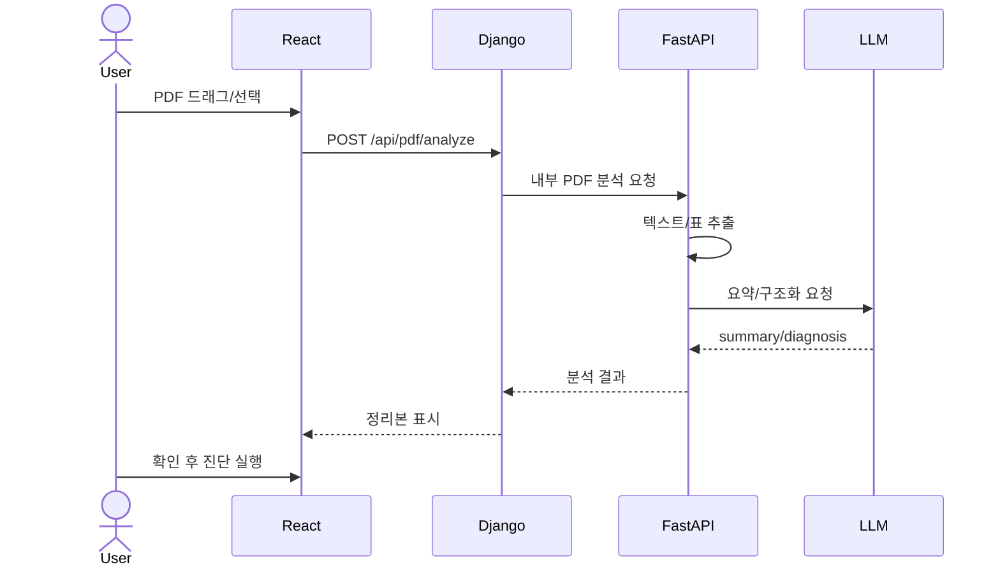

# 10분 발표자료 구성 가이드

## 발표 핵심 메시지

이번 프로젝트의 핵심은 기존 청약 AI 진단 엔진을 실제 사용자가 접근할 수 있는 웹서비스로 확장한 것입니다. React는 사용자 화면, Django는 인증·저장·공개 API 경계, FastAPI는 LangGraph·RAG·PDF 분석 AI 엔진을 담당하도록 분리했고, Docker와 EC2 기반 배포 구조를 통해 외부 접속 가능한 서비스 형태로 정리했습니다.

## 추천 슬라이드 구성

| 순서 | 제목 | 핵심 내용 | 화면/자료 |
|---|---|---|---|
| 1 | 표지 | A-FIT 청약 진단 서비스 | 서비스명, 팀명 |
| 2 | 프로젝트 목표 | AI 진단 엔진을 웹서비스로 전환 | Before/After |
| 3 | 기존 한계와 개선 방향 | FastAPI AI 엔진만으로는 사용자/이력/권한 관리 부족 | 문제-해결 표 |
| 4 | 사용자 주요 흐름 | 회원가입 -> 프로필 -> PDF/공고 진단 -> 결과 -> 마이페이지 -> 챗봇 | 플로우차트 |
| 5 | 전체 아키텍처 | React-Django-FastAPI 분리 | `SYSTEM_ARCHITECTURE_FINAL.md` Mermaid |
| 6 | 화면설계/UI 흐름 | 마이페이지, 결과 상세, Floating 챗봇 | 주요 화면 캡처 |
| 7 | PDF 분석 시퀀스 | PDF 업로드 -> 추출 -> LLM/규칙 요약 -> 전략 진단 연결 | 시퀀스 |
| 8 | LLM/RAG 챗봇 흐름 | ChromaDB 검색, OpenAI 답변 합성, 출처 표시 | RAG 흐름 |
| 9 | Docker/EC2 배포 구조 | Docker Hub 이미지 pull, docker compose up | 배포 가이드 요약 |
| 10 | 테스트 및 검증 결과 | lint/typecheck/test/build, 브라우저 검증, 배포 NOT_TESTED 구분 | 테스트 표 |
| 11 | 시연 | 기본 진단, PDF 진단, 마이페이지, 챗봇 | 실제 화면 |
| 12 | 한계와 후속 과제 | RDS/S3/HTTPS/CI/CD, PDF 정확도, 자동 회귀 | TODO |

## 슬라이드별 발표 스크립트 요약

### 1. 표지

- "A-FIT은 청약 조건과 모집공고를 기반으로 사용자에게 참고용 청약 진단 리포트를 제공하는 웹서비스입니다."

### 2. 프로젝트 목표

- "기존에는 AI 진단 엔진과 RAG 기능 중심이었고, 사용자가 계정을 만들고 결과를 다시 보는 서비스 구조는 부족했습니다."
- "이번 프로젝트에서는 React-Django-FastAPI 구조로 확장했습니다."

### 3. 기존 한계와 개선 방향

| 기존 한계 | 개선 방향 |
|---|---|
| 사용자/세션/이력 관리 부족 | Django session, Profile, StrategyRun 도입 |
| 공고문 PDF 원문이 복잡함 | PDF 추출 + 요약/정리본 + 사용자 확인 |
| 결과 재조회 어려움 | 마이페이지와 공고별 이력 |
| 챗봇 화면 점유 | Floating 챗봇 |

### 4. 사용자 주요 흐름

### 5. 전체 아키텍처

- React는 사용자 화면만 담당한다.
- Django는 인증, 세션, 저장, API 경계를 담당한다.
- FastAPI는 LangGraph, RAG, PDF, LLM 연동을 담당한다.
- 이 분리로 브라우저가 AI 내부 API를 직접 호출하지 않는다.

### 6. 화면설계/UI 흐름

- `진단 기록`을 `마이페이지`로 정리했다.
- 마이페이지는 계정 정보 -> 기본 정보 진단 -> 공고 기반 분석 순서로 구성했다.
- 결과 상세는 AFIT Report 형태로 정리하고, 프로필 확인은 Floating 버튼으로 제공한다.
- 챗봇은 우하단 Floating 버튼으로 열고 닫는다.

### 7. PDF 분석 시퀀스

### 8. LLM/RAG 안정성

- 결정론적 계산은 코드가 담당한다.
- LLM은 공고문 구조화, 설명 생성, 요약, RAG 답변 합성에 사용한다.
- PDF LLM 요약 실패 시 규칙 기반 정리본을 유지한다.
- RAG 검색 실패 시 `found=False` 또는 안내 메시지로 처리해 전체 흐름을 유지한다.
- timeout과 사용자 오류 메시지를 분리한다.

### 9. Docker/EC2 배포

추천 표현:

"이번 프로젝트에서는 EC2에 Docker 기반 배포 환경을 구성하고, Docker Hub 이미지를 pull하여 컨테이너 단위로 재현 가능한 배포가 가능하도록 했습니다. 데이터베이스와 정적 파일 운영 고도화는 추후 PostgreSQL/RDS, S3 적용 대상으로 남겨두었습니다."

주의:

- 실제 발표 전 `docker compose pull`, `docker compose up -d`, 외부 URL 접속 확인 필요
- HTTPS/RDS/S3/CI/CD는 완료로 표현하지 말 것

### 10. 테스트 및 검증 결과

강조할 PASS:

- `pnpm lint`
- `pnpm typecheck`
- `pnpm test`
- `pnpm build`
- Django accounts 테스트
- 배포 설정 정적 테스트
- 브라우저 모바일/데스크톱 수동 검증

구분할 NOT_TESTED:

- EC2 실배포 재기동
- Docker Hub pull/up 직접 확인
- 챗봇 실제 RAG 질의
- 다건 PDF 품질 회귀

### 11. 시연 순서

1. 로그인
2. 마이페이지 계정 카드 확인
3. 기본 진단 실행
4. 결과 상세에서 `내 프로필` Floating 확인
5. PDF 분석 또는 전략 진단 화면 확인
6. Floating 챗봇 열기

### 12. 한계와 후속 과제

- SQLite -> PostgreSQL/RDS
- HTTP -> HTTPS
- CI/CD 자동화
- React DOM/네트워크 모킹 테스트 보강
- PDF 구조화 정확도 개선
- 접근성/반응형 회귀 테스트 자동화
- 운영 CSRF/secure cookie 적용 및 보안 회귀 테스트

## 발표 전 체크리스트

- [ ] PR merge 후 final 브랜치 기준 화면 다시 확인
- [ ] Docker 이미지 빌드/푸시 여부 확인
- [ ] EC2에서 `docker compose pull && docker compose up -d`
- [ ] `docker ps`, `docker compose logs --tail=100` 확인
- [ ] `http://a-fit.duckdns.org/` 접속 확인
- [ ] 로그인/기본 진단/PDF/챗봇 중 최소 1회 시연 리허설

