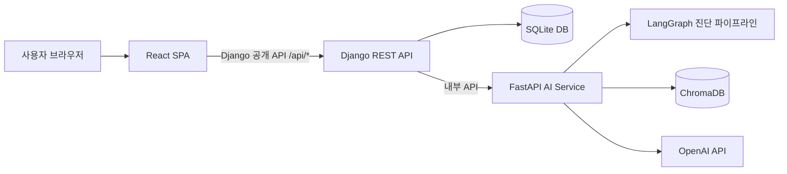

# 요구사항 정의서 최종본

| 항목 | 내용 |
|---|---|
| 프로젝트 | A-FIT 청약 진단 서비스 |
| 문서 상태 | 최종 제출 후보 |
| 작성일 | 2026-07-08 |
| 기준 브랜치 | `pdf-improvement-0707` |
| 기준 커밋 | `9992295 Improve mypage report UX and deployment checks` |
| 대상 | React SPA / Django REST API / FastAPI LangGraph RAG PDF 엔진 |

## 1. 목적과 범위

A-FIT은 기존 FastAPI/LangGraph/RAG 기반 청약 AI 진단 엔진을 실제 사용자가 접근 가능한 웹서비스로 확장한 프로젝트다. React는 사용자 화면, Django는 인증/세션/저장/공개 API 경계, FastAPI는 AI 진단/PDF/RAG 처리를 담당한다.

본 문서는 기능 요구사항, 비기능 요구사항, LLM 연동 요구사항, 사용자 시나리오, 산출물 간 추적성을 평가 제출 기준에 맞춰 정리한다.

## 2. 시스템 개요

원칙은 다음과 같다.

- React는 Django 공개 API만 호출한다.
- Django는 사용자 인증, 프로필, 진단 이력, FastAPI proxy를 담당한다.
- FastAPI는 LangGraph 파이프라인, PDF 분석, RAG 챗봇, LLM 호출을 담당한다.
- 결정론적 계산은 코드가 담당하고, LLM은 공고문 구조화/요약/설명/RAG 답변 합성에 사용한다.
- PDF 원본은 저장하지 않고, 요약/정리본/구조화 필드만 진단 이력에 남긴다.

## 3. 사용자 시나리오

| ID | 시나리오 | 주요 흐름 | 연결 화면/API | 상태 |
|---|---|---|---|---|
| UC-01 | 회원가입/로그인 | 이메일/비밀번호 입력, 세션 발급, 보호 화면 이동 | `/login`, `POST /api/auth/signup`, `POST /api/auth/login` | 완료 |
| UC-02 | 프로필 등록/수정 | 청약통장/거주/무주택/세대/소득 정보 저장 | `/profile`, `GET/PUT /api/user/profile` | 완료 |
| UC-03 | 기본 정보 진단 | 저장 프로필만으로 진단 실행 | `/mypage`, `/results/:id`, `POST /api/strategy` | 완료 |
| UC-04 | 공고문 직접 입력 진단 | 텍스트 공고문 입력 후 상세 진단 | `/strategy`, `POST /api/strategy` | 완료, 최신 수동 회귀는 확인 필요 |
| UC-05 | PDF 모집공고 분석 | PDF 업로드, 요약/정리본 확인, 전략 진단 연결 | `/strategy`, `/pdf`, `POST /api/pdf/analyze` | 완료, 품질 회귀는 추가 필요 |
| UC-06 | 진단 이력 조회 | 마이페이지에서 공고별/기본 진단 이력 조회 | `/mypage`, `GET /api/strategy/me` | 완료 |
| UC-07 | 결과 상세 조회 | 추천 공급유형, 요약, 공고/재무/전략 확인 | `/results/:id`, `GET /api/strategy/{id}` | 완료 |
| UC-08 | RAG 챗봇 | 질문 입력, 답변/출처 확인, 세션 유지 | Floating 챗봇, `/chatbot`, `POST /api/chatbot` | 완료, 실제 RAG 질의는 확인 필요 |
| UC-09 | 계정 관리 | 비밀번호 변경, 비밀번호 확인 후 계정 삭제 | `/mypage`, `/api/auth/password`, `DELETE /api/auth` | 완료 |

## 4. 기능 요구사항

### 4.1 인증/계정

| ID | 요구사항 | 상태 | 구현/검증 |
|---|---|---|---|
| FR-AUTH-01 | 사용자는 이메일/비밀번호로 로그인할 수 있어야 한다 | 완료 | Django session, 프론트 계약 테스트 |
| FR-AUTH-02 | 사용자는 계정을 생성할 수 있어야 한다 | 완료 | 이메일 중복/비밀번호 검증 |
| FR-AUTH-03 | 보호 화면은 미인증 사용자를 `/login`으로 보내야 한다 | 완료 | `AuthProvider`, 계약 테스트 |
| FR-AUTH-04 | 로그인/회원가입 요청은 rate limit을 적용해야 한다 | 완료 | Django throttle |
| FR-AUTH-05 | 사용자는 비밀번호를 변경할 수 있어야 한다 | 완료 | `POST /api/auth/password`, accounts 테스트 |
| FR-AUTH-06 | 사용자는 비밀번호 확인과 최종 확인 모달 후 계정을 삭제할 수 있어야 한다 | 완료 | `DELETE /api/auth`, accounts 테스트 |

### 4.2 프로필

| ID | 요구사항 | 상태 | 구현/검증 |
|---|---|---|---|
| FR-PROFILE-01 | 청약 프로필을 조회/저장/수정할 수 있어야 한다 | 완료 | `GET/PUT/PATCH /api/user/profile` |
| FR-PROFILE-02 | 조건부 입력은 관련 조건에 따라 노출되어야 한다 | 완료 | 프론트 계약 테스트 |
| FR-PROFILE-03 | 금액 입력은 사용자 편의를 위해 만원 단위로 받을 수 있어야 한다 | 완료 | 프론트 계약 테스트 |
| FR-PROFILE-04 | 필수값 누락 시 진단 실행 전에 차단해야 한다 | 완료 | Django serializer |

### 4.3 전략 진단/결과

| ID | 요구사항 | 상태 | 구현/검증 |
|---|---|---|---|
| FR-STRATEGY-01 | 프로필 기반 기본 진단을 실행할 수 있어야 한다 | 완료 | 브라우저 수동 검증 PASS |
| FR-STRATEGY-02 | 공고문 텍스트 기반 진단을 실행할 수 있어야 한다 | 완료 | 최신 수동 회귀는 확인 필요 |
| FR-STRATEGY-03 | 진단 결과는 이력에 저장되어야 한다 | 완료 | `StrategyRun` |
| FR-STRATEGY-04 | 결과 상세에서 추천 공급유형/요약/확인항목을 볼 수 있어야 한다 | 완료 | 브라우저 수동 검증 |
| FR-STRATEGY-05 | 결과 상세에서 프로필 스냅샷을 Floating UI로 볼 수 있어야 한다 | 완료 | 브라우저 수동 검증 |
| FR-STRATEGY-06 | `다시 진단하기`는 프로필 화면 최상단으로 이동해야 한다 | 완료 | 브라우저 수동 검증 |

### 4.4 PDF 분석

| ID | 요구사항 | 상태 | 구현/검증 |
|---|---|---|---|
| FR-PDF-01 | PDF 파일을 업로드해 텍스트/표를 추출할 수 있어야 한다 | 완료 | PDF 서비스 구현, 추가 회귀 필요 |
| FR-PDF-02 | LLM 요약 또는 규칙 기반 요약으로 공고문을 정리해야 한다 | 완료 | summary_source 지원 |
| FR-PDF-03 | PDF 원본은 저장하지 않아야 한다 | 완료 | 원본 미저장 원칙 |
| FR-PDF-04 | 업로드 용량 제한은 프론트/백엔드/Nginx에서 일관되어야 한다 | 완료 | 15MB 정책, Nginx 20MB |

### 4.5 마이페이지/챗봇

| ID | 요구사항 | 상태 | 구현/검증 |
|---|---|---|---|
| FR-MYPAGE-01 | `진단 기록` 탭은 `마이페이지`로 표시되어야 한다 | 완료 | 브라우저/계약 테스트 |
| FR-MYPAGE-02 | 계정 정보 카드와 진단 수를 표시해야 한다 | 완료 | 브라우저 수동 검증 |
| FR-MYPAGE-03 | 기본 정보 진단은 계정 카드 아래에 위치해야 한다 | 완료 | 브라우저 수동 검증 |
| FR-MYPAGE-04 | 공고 기반 분석은 공고명/아파트명 중심 카드로 관리되어야 한다 | 완료 | 계약 테스트 |
| FR-CHAT-01 | 챗봇은 Floating 버튼으로 열고 닫을 수 있어야 한다 | 완료 | 브라우저 수동 검증 |
| FR-CHAT-02 | 챗봇은 질문/답변과 출처를 표시해야 한다 | 완료 | 실제 RAG 질의는 확인 필요 |

## 5. 비기능 요구사항

| ID | 구분 | 요구사항 | 상태 |
|---|---|---|---|
| NFR-UI-01 | UI | 반응형 레이아웃을 지원해야 한다 | 완료. 390px/1280px 브라우저 확인 |
| NFR-UI-02 | UI | 로딩/오류/빈 상태를 표시해야 한다 | 완료 |
| NFR-ACC-01 | 접근성 | 모달/플로팅 UI는 role/aria/focus 동작을 갖춰야 한다 | 완료. 일부 자동 테스트 보강 |
| NFR-SEC-01 | 보안 | 세션 기반 인증과 사용자별 데이터 격리를 적용해야 한다 | 완료 |
| NFR-SEC-02 | 보안 | 운영 환경 secure cookie/HTTPS는 분리 관리해야 한다 | 후속 과제 |
| NFR-PERF-01 | 안정성 | 장시간 요청은 timeout 또는 오류 안내를 제공해야 한다 | 완료, 장애 주입 추가 필요 |
| NFR-DEP-01 | 배포 | Docker Compose 기반 실행 구조를 제공해야 한다 | 완료. 실제 이미지 빌드/EC2 검증은 NOT_TESTED |
| NFR-DATA-01 | 데이터 | SQLite 데이터는 Docker volume으로 유지할 수 있어야 한다 | 설계 완료, 재기동 검증 필요 |
| NFR-TEST-01 | 테스트 | TypeScript/build/test/lint를 통과해야 한다 | 완료 |

## 6. LLM 연동 요구사항

| ID | 요구사항 | 처리 방식 | 상태 |
|---|---|---|---|
| LLM-REQ-01 | 외부 LLM API Key는 환경변수로 관리해야 한다 | `OPENAI_API_KEY` | 완료 |
| LLM-REQ-02 | LLM은 계산값을 임의로 판단하지 않아야 한다 | 자격/가점/재무 계산은 코드 담당 | 완료 |
| LLM-REQ-03 | PDF 요약 실패 시 진단 흐름이 중단되지 않아야 한다 | 규칙 기반 정리본 유지 | 완료, 장애 주입 테스트 필요 |
| LLM-REQ-04 | RAG 검색 실패가 전체 서비스 실패로 이어지지 않아야 한다 | found=false 또는 안내 응답 | 완료, 장애 주입 테스트 필요 |
| LLM-REQ-05 | 비동기 요청은 로딩/중복 방지/오류 메시지를 제공해야 한다 | 프론트 상태값과 Django 오류 envelope | 완료 |

## 7. 산출물 간 추적성

| 요구사항 | 화면 | API | 테스트 |
|---|---|---|---|
| FR-AUTH-01~06 | `/login`, `/mypage` | `/api/auth/*` | AUTO-BE-01, TC-AUTH-* |
| FR-PROFILE-01~04 | `/profile` | `/api/user/profile` | TC-PROFILE-* |
| FR-STRATEGY-01~06 | `/strategy`, `/results/:id`, `/mypage` | `/api/strategy*` | MAN-FE-06~08 |
| FR-PDF-01~04 | `/strategy`, `/pdf` | `/api/pdf/analyze` | TC-PDF-* |
| FR-MYPAGE-01~04 | `/mypage` | `/api/auth/me`, `/api/strategy/me` | MAN-FE-02~05 |
| FR-CHAT-01~02 | Floating 챗봇, `/chatbot` | `/api/chatbot` | MAN-FE-04, TC-CHAT-* |
| NFR-DEP-01 | 배포 구성 | Nginx/Docker Compose | AUTO-DEP-01 |

## 8. 후속 과제

- EC2 실서버 Docker pull/up, 외부 URL 접속, DB volume 유지 검증
- HTTP 배포에서 HTTPS 적용
- SQLite에서 PostgreSQL/RDS 전환
- S3 정적/미디어 파일 운영 분리
- CI/CD 자동화
- PDF 구조화 정확도 회귀 테스트 데이터셋 확대
- LLM/RAG 장애 주입 자동 테스트

