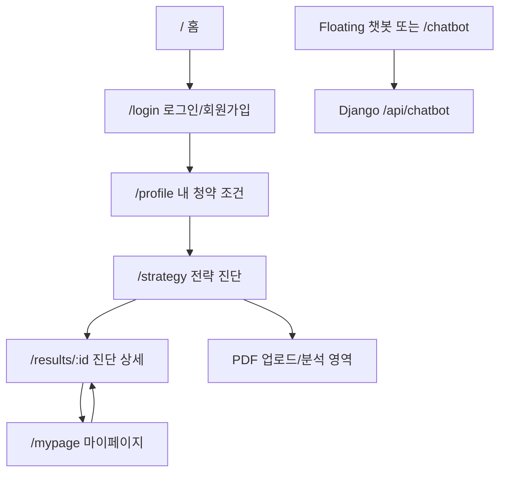
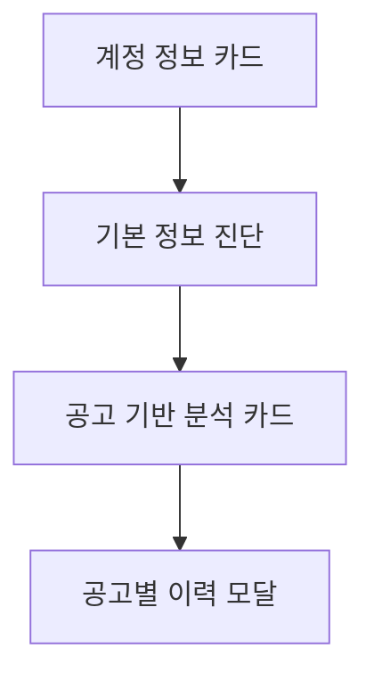

# 화면설계서 최종본

| 항목 | 내용 |
|---|---|
| 프로젝트 | A-FIT 청약 진단 서비스 |
| 작성일 | 2026-07-08 |
| 문서 상태 | 최종 제출 후보 |
| 기준 | React SPA -> Django REST API -> FastAPI AI Service |

## 1. 공통 화면 원칙

| 항목 | 설계 |
|---|---|
| 라우팅 | React Router 기반 URL 라우팅 |
| 인증 | Django session cookie, `AuthProvider`에서 `GET /api/auth/me` 확인 |
| 보호 화면 | 비로그인 사용자는 `/login`으로 이동 |
| 반응형 | 모바일 단일 열, 데스크톱 중앙 콘텐츠, 플로팅 챗봇 |
| 오류 상태 | API 오류 envelope를 사용자 문구와 필드 오류로 변환 |
| 로딩 상태 | 제출/분석/업로드 중 버튼 비활성화와 진행 UI 표시 |
| LLM UX | 요청 중 중복 방지, timeout/실패 안내, fallback 정리본 유지 |
| 데이터 경계 | React는 Django 공개 API만 호출 |

## 2. 전체 화면 구조

## 3. 화면별 상세 설계

| 화면 | URL | 목적 | 접근 권한 | 주요 입력 | 연결 API | 로딩 | 성공 | 오류 | 빈 상태 |
|---|---|---|---|---|---|---|---|---|---|
| 랜딩 | `/` | 서비스 소개와 진입 | 공개 | CTA | `GET /api/auth/me` | 인증 확인 | 보호 화면/로그인 이동 | 인증 실패 시 비로그인 처리 | 해당 없음 |
| 로그인/회원가입 | `/login` | 계정 생성/로그인 | 공개 | 이메일, 비밀번호, 비밀번호 확인 | `POST /api/auth/login`, `POST /api/auth/signup` | 제출 중 버튼 문구 변경 | 세션 발급 후 이동 | 중복/비밀번호/인증 오류 표시 | 입력 전 폼 |
| 내 청약 조건 | `/profile` | 프로필 조회/저장 | 로그인 | 청약통장, 거주, 무주택, 세대, 소득/자산 | `GET/PUT/PATCH /api/user/profile` | 조회/저장 상태 | 저장 완료 안내 | 필드 오류 표시 | 프로필 없음 -> 신규 작성 |
| 전략 진단 | `/strategy` | 공고문/PDF 기반 진단 실행 | 로그인 | 공고문 텍스트, PDF, 공고 없음 체크 | `POST /api/strategy`, `POST /api/pdf/analyze` | PDF 추출/진단 진행 카드 | 결과 상세 이동 | 파일/분석/timeout 오류 표시 | 공고문 미입력 안내 |
| 마이페이지 | `/mypage` | 계정과 진단 이력 확인 | 로그인 | 계정 관리, 기본 진단, 기록 선택 | `GET /api/auth/me`, `GET /api/strategy/me`, `POST /api/strategy` | 목록 조회/기본 진단 중 | 계정 카드, 기본 진단, 공고 기반 분석 표시 | 조회 오류 표시 | 저장된 진단 없음 안내 |
| 결과 상세 | `/results/:id` | 리포트 확인 | 로그인 | PDF 저장, 내 프로필, 다시 진단하기 | `GET /api/strategy/{id}` | 상세 조회 | AFIT Report, 요약/공고/재무/전략 표시 | 상세 조회 실패 | 항목 없음 문구 |
| 챗봇 | Floating, `/chatbot` | 청약 제도 RAG 질의응답 | 로그인 | 질문, 추천 질문 | `POST /api/chatbot` | 답변 작성 중 | 답변과 출처 표시 | 챗봇 실패 메시지 | 인사말/추천 질문 |

## 4. 주요 화면 UX

### 4.1 마이페이지

- 탭명은 `마이페이지`로 표시한다.
- 상단에는 계정 정보, 이메일, 가입일, 전체/완료 진단 수를 카드로 표시한다.
- 계정 관리 버튼에서 비밀번호 변경과 계정 삭제를 제공한다.
- 기본 정보 진단은 계정 카드 아래에 배치하고, 공고 기반 분석은 그 아래에 둔다.
- 마이페이지 새로고침 버튼은 제거한다.

### 4.2 결과 상세

- 상단은 `AFIT REPORT` 형태의 리포트 헤더로 구성한다.
- 공고 기본 정보는 표가 아니라 `Supply Summary`와 `Schedule` 카드 그룹으로 표시한다.
- 우하단에는 `내 프로필` Floating 버튼을 두고, 클릭 시 진단 당시 프로필 스냅샷을 모달로 보여준다.
- `다시 진단하기`는 `/profile`로 이동하고 최상단에서 시작한다.
- PDF 저장은 `window.print()` 기반으로 동작한다.
- 리포트 마지막에는 참고용 진단과 공식 공고 확인 필요성을 알리는 면책 조항을 둔다.

### 4.3 챗봇

- 전체 레이아웃을 차지하던 우측 고정 패널 대신 우하단 Floating 버튼을 사용한다.
- 버튼 클릭 시 챗봇 패널이 열리고, 다시 클릭하면 닫힌다.
- 모바일에서도 화면 폭을 넘지 않도록 `calc(100vw - 40px)` 제한을 둔다.
- 접근성을 위해 패널에 `role="dialog"`와 `aria-label`을 적용한다.

## 5. 조건부 입력 설계

| 기준 입력 | 조건 | 추가 노출 항목 | 조건 해제 시 |
|---|---|---|---|
| 거주 지역 | 지역 선택 | 현재 지역 거주 기간 | 관련 값 초기화 |
| 무주택 여부 | 무주택 | 무주택 기간 | 관련 값 초기화 |
| 혼인 상태 | 기혼 | 혼인 기간, 맞벌이 여부 | 관련 값 초기화 |
| 세대원 수 | 2명 이상 | 부양가족 수 | 관련 값 초기화 |
| 미성년 자녀 수 | 1명 이상 | 영유아 자녀 수, 자녀 연령대 | 관련 값 초기화 |
| 노부모 부양 상태 | 부양 중 | 노부모 무주택 여부 | 관련 값 초기화 |

## 6. LLM 상호작용 UX

| 상태 | 전략 진단 | PDF 분석 | 챗봇 |
|---|---|---|---|
| 대기 | 입력 가능 | 파일 선택/드래그 가능 | 추천 질문/입력 가능 |
| 요청 중 | 중복 실행 차단, 진행 표시 | 파일 확인 -> 내용 추출 -> 결과 정리 단계 표시 | 답변 작성 중 표시 |
| 성공 | 결과 상세 이동 | 정리본을 전략 입력으로 전달 | 답변/출처 표시 |
| 실패 | 사용자용 오류 안내 | 형식/크기/분석 오류 안내 | 오류 메시지 버블 |
| 장시간 | timeout 안내 | 분석 중 이탈 방지 문구 | Django timeout 결과 표시 |

## 7. 구현 파일 매핑

| 설계 영역 | 구현 파일 |
|---|---|
| 라우팅 | `frontend-react/src/app/routes.tsx` |
| 보호 레이아웃/챗봇 | `frontend-react/src/app/components/Layout.tsx` |
| 헤더 | `frontend-react/src/app/components/SiteHeader.tsx` |
| 인증 상태 | `frontend-react/src/app/auth/AuthContext.tsx` |
| API client | `frontend-react/src/app/api/client.ts` |
| 프로필 | `frontend-react/src/app/pages/Profile.tsx` |
| 전략 진단 | `frontend-react/src/app/pages/StrategyRun.tsx`, `pages/strategy-run/*` |
| 마이페이지 | `frontend-react/src/app/pages/MyPage.tsx` |
| 결과 상세 | `frontend-react/src/app/pages/ResultDetail.tsx` |
| PDF 분석 | `frontend-react/src/app/pages/PdfAnalysis.tsx` |
| 챗봇 | `frontend-react/src/app/components/ChatbotPanel.tsx` |

## 8. 운영 고도화 및 후속 개선 과제

- React Testing Library 또는 Playwright 기반 실제 DOM 상호작용 테스트
- 화면 회귀 캡처 자동화
- PDF 분석 결과 품질 비교 화면
- 운영 CSRF/secure cookie/HTTPS 적용 후 인증 회귀 테스트
- 더 세밀한 스켈레톤 UI
- 접근성 자동 검사 도입

