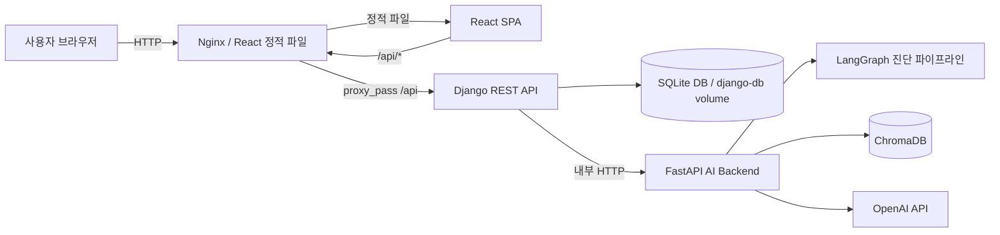
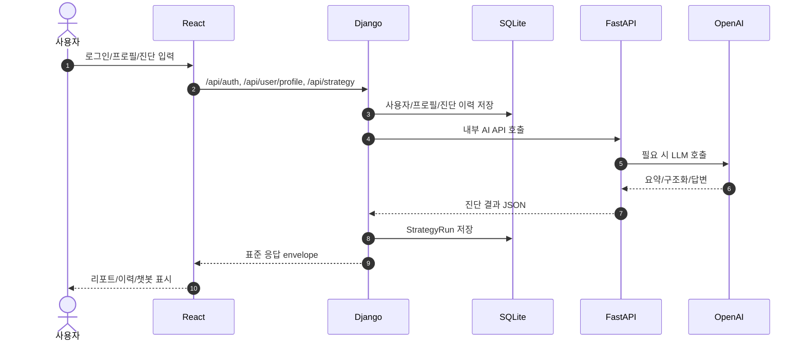
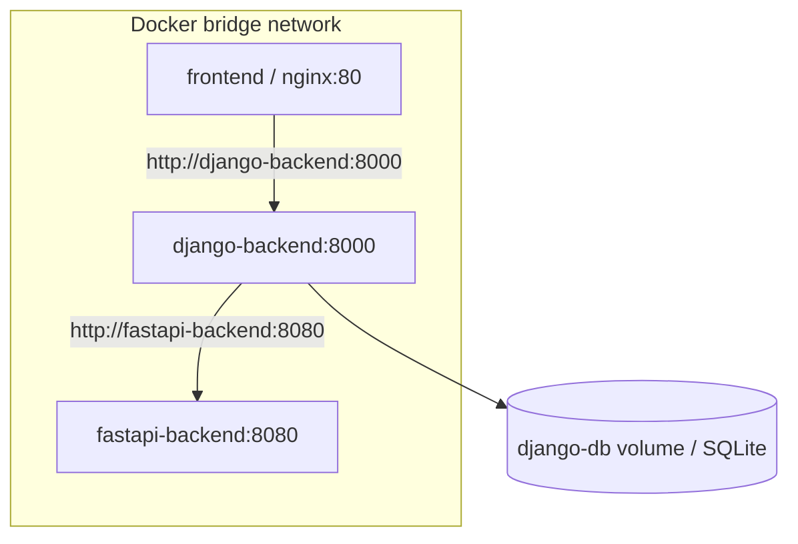
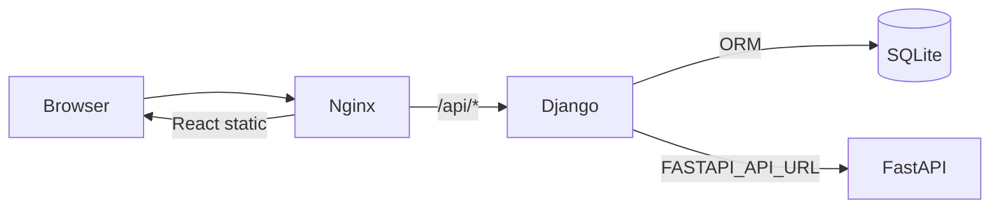
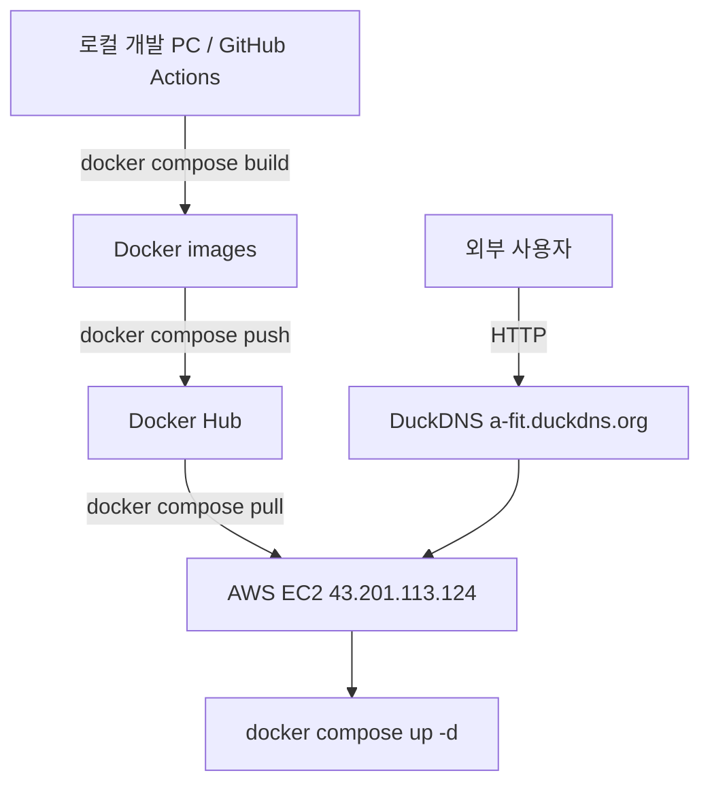
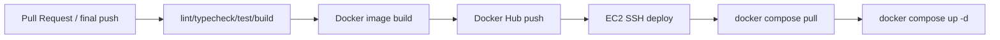

# 시스템 구성도 최종본

| 항목 | 내용 |
|---|---|
| 프로젝트 | A-FIT 청약 진단 서비스 |
| 작성일 | 2026-07-09 |
| 문서 상태 | 최종 제출본 |
| 기준 | React / Django / FastAPI / SQLite / ChromaDB / OpenAI |

## 1. 전체 아키텍처

핵심 분리는 다음과 같다.

| 계층 | 책임 |
|---|---|
| React | 사용자 화면, 입력, 로딩/오류, 결과 표시 |
| Nginx | React 정적 파일 제공, `/api` 요청을 Django로 프록시, PDF 업로드 edge limit |
| Django | 인증, 세션, 사용자 프로필, 진단 이력 저장, FastAPI proxy |
| FastAPI | LangGraph 진단, RAG 챗봇, PDF 텍스트/표 추출, LLM 호출 |
| SQLite | 사용자, 프로필, 진단 이력 저장 |
| ChromaDB | RAG 검색 collection |
| OpenAI API | 공고문 구조화, 요약, 설명 생성, RAG 답변 합성 |

## 2. 요청 흐름

## 3. Docker Compose 구성

현재 repository에는 개발/운영용 compose 파일이 존재한다.

| 파일 | 용도 | 상태 |
|---|---|---|
| `docker-compose.yml` | 로컬 빌드 기반 3개 서비스 실행 | 구성 확인 |
| `docker-compose.prod.yml` | Docker Hub 이미지 pull 기반 실행 | EC2 배포 반영 |

서비스 구성은 다음과 같다.

| 서비스 | 이미지 | 내부 포트 | 호스트 포트 | 비고 |
|---|---|---|---|---|
| frontend | `dongyoon99/frontend-react:latest` | 80 | 80:80 | React build + Nginx |
| django-backend | `dongyoon99/django-backend:latest` | 8000 | 8000:8000 | session, DB, proxy, Gunicorn |
| fastapi-backend | `dongyoon99/fastapi-backend:latest` | 8080 | 8080:8080 | AI/RAG/PDF |
| django-db | Docker volume | - | - | SQLite 파일 유지 |

운영 배포는 AWS 인바운드 80번 포트로 Nginx frontend 컨테이너에 인입되며, 사용자는 별도 포트 번호 없이 `http://a-fit.duckdns.org/`로 접속한다.

## 4. Nginx-Django-FastAPI 구조

현재 확인된 Nginx 설정:

- `/api/` 요청은 `http://django-backend:8000/api/`로 전달
- `/admin/` 요청은 `http://django-backend:8000/admin/`으로 전달
- `/static/admin/` 요청은 `http://django-backend:8000/static/admin/`으로 전달
- SPA 라우팅은 `try_files $uri $uri/ /index.html`
- PDF multipart 업로드를 고려해 `client_max_body_size 20m`
- `proxy_read_timeout`, `proxy_send_timeout`은 `deploy/nginx/default.conf` 기준 120초

Django 배포 이미지는 컨테이너 시작 시 `migrate`, `collectstatic --noinput`을 수행한 뒤 `gunicorn config.wsgi:application --bind 0.0.0.0:8000 --workers 3`로 서비스를 시작한다. 정적 파일 수집 및 서빙 보조를 위해 Django requirements에 `gunicorn`, `whitenoise`를 포함한다.

## 5. 클라우드/배포 구조

최종 배포 구조는 Docker Hub와 AWS EC2를 중심으로 다음 흐름을 따른다.

| 항목 | 현재 문서화 상태 |
|---|---|
| EC2 | `43.201.113.124`, SSH 기반 운영 서버 |
| Docker Hub | `dongyoon99/*` 이미지명 사용 |
| DuckDNS | `a-fit.duckdns.org` |
| HTTPS | 미적용. 현재 최종 배포는 HTTP 기준 |
| RDS/S3 | 미적용. 후속 과제 |
| CI/CD | GitHub Actions 기준 build/test/image push/deploy 자동화 |

## 5.1 GitHub Actions CI/CD 흐름

최종 운영 기준의 CI/CD는 GitHub Actions에서 코드 변경을 감지한 뒤 검증, 이미지 빌드, Docker Hub 푸시, EC2 배포 명령 실행 순서로 구성한다.

CI/CD secrets는 GitHub 저장소 설정에서 관리한다.

| Secret | 용도 |
|---|---|
| `DOCKERHUB_USERNAME`, `DOCKERHUB_TOKEN` | Docker Hub 로그인 및 이미지 push |
| `EC2_HOST`, `EC2_USER`, `EC2_SSH_KEY` | EC2 SSH 접속 |
| `OPENAI_API_KEY`, `DJANGO_SECRET_KEY` 등 | 운영 `.env` 또는 서버 환경 변수 관리 |

## 6. 보안/확장성 고려사항

| 항목 | 현재 상태 | 후속 과제 |
|---|---|---|
| 인증 | Django session 기반, HTTP 배포용 CSRF/CORS/cookie 설정 반영 | HTTPS 적용 시 secure cookie 재전환 |
| 권한 | 사용자별 프로필/진단 이력 격리 | 보안 회귀 테스트 |
| API 경계 | React -> Django -> FastAPI | 유지 |
| 비밀값 | `.env`, `.env.production.example` | 실제 운영 값은 Git 제외 |
| DB | SQLite + Docker volume | PostgreSQL/RDS 전환 |
| 정적 파일 | frontend Nginx 컨테이너 | S3/CloudFront 선택 가능 |
| HTTPS | 미적용, HTTP 80 운영 | 인증서/리버스 프록시 적용 |

## 7. 정확히 표현해야 할 한계

- Docker 이미지 build/push, Docker Hub pull, EC2 `docker compose up -d`, 외부 URL 접속을 검증했다.
- 운영 URL은 `http://a-fit.duckdns.org/` 기준으로 설명한다.
- HTTPS, PostgreSQL/RDS, S3/CloudFront는 아직 운영 고도화 과제로 분리한다.
