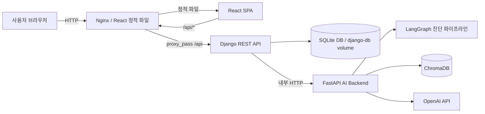
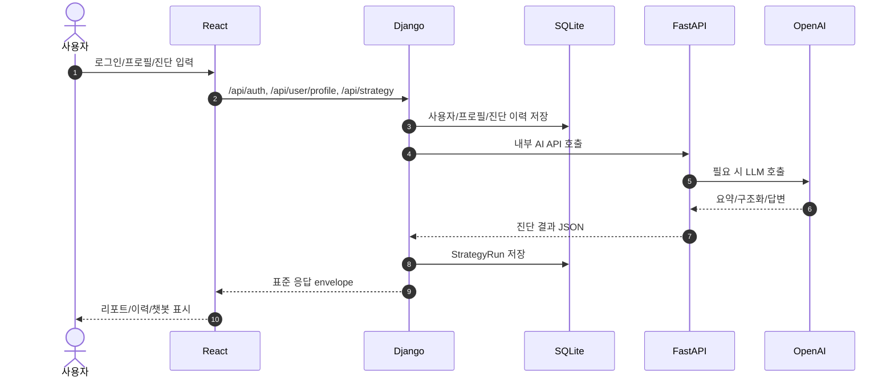
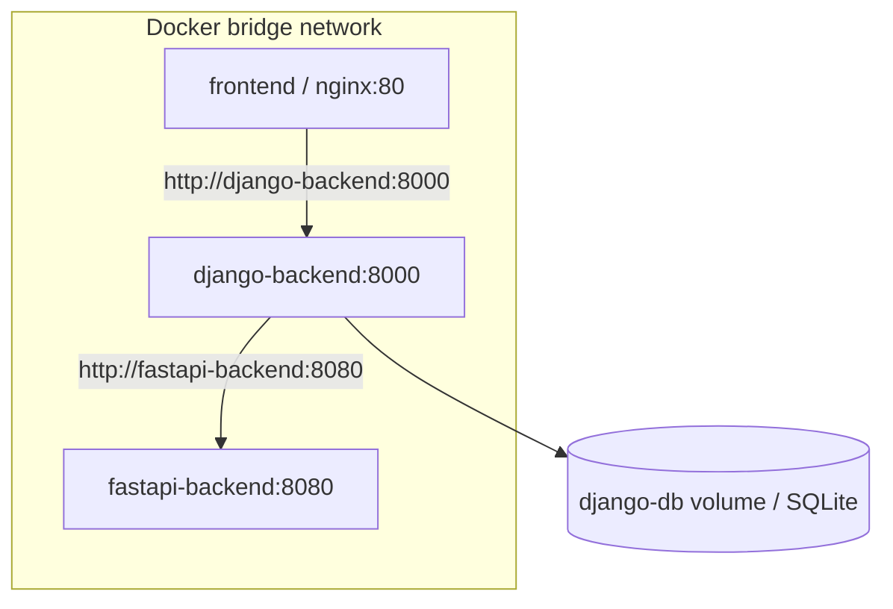
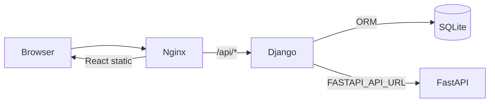
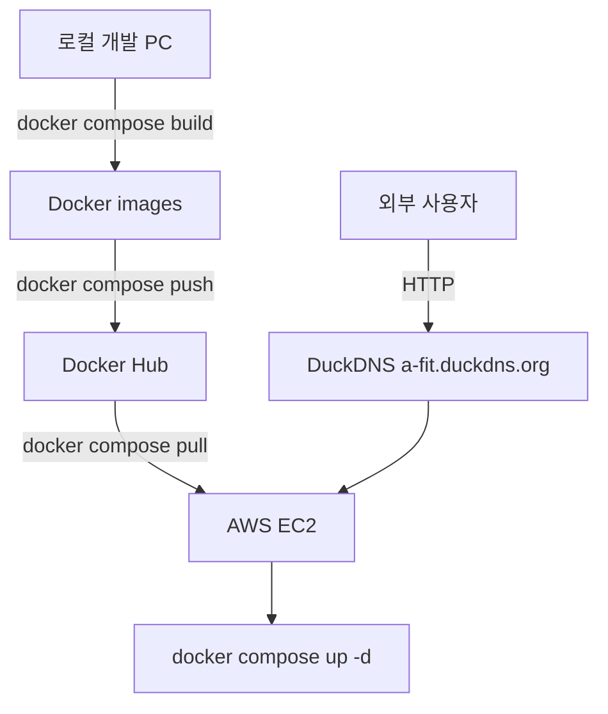

# 시스템 구성도 최종본

| 항목 | 내용 |
|---|---|
| 프로젝트 | A-FIT 청약 진단 서비스 |
| 작성일 | 2026-07-08 |
| 문서 상태 | 최종 제출 후보 |
| 기준 | React / Django / FastAPI / SQLite / ChromaDB / OpenAI |

## 1. 전체 아키텍처

핵심 분리는 다음과 같다.

| 계층 | 책임 |
|---|---|
| React | 사용자 화면, 입력, 로딩/오류, 결과 표시 |
| Nginx | React 정적 파일 제공, `/api` 요청을 Django로 프록시, PDF 업로드 edge limit |
| Django | 인증, 세션, 사용자 프로필, 진단 이력 저장, FastAPI proxy |
| FastAPI | LangGraph 진단, RAG 챗봇, PDF 텍스트/표 추출, LLM 호출 |
| SQLite | 사용자, 프로필, 진단 이력 저장 |
| ChromaDB | RAG 검색 collection |
| OpenAI API | 공고문 구조화, 요약, 설명 생성, RAG 답변 합성 |

## 2. 요청 흐름

## 3. Docker Compose 구성

현재 repository에는 개발/운영용 compose 파일이 존재한다.

| 파일 | 용도 | 상태 |
|---|---|---|
| `docker-compose.yml` | 로컬 빌드 기반 3개 서비스 실행 | 구성 확인 |
| `docker-compose.prod.yml` | Docker Hub 이미지 pull 기반 실행 | 구성 확인, EC2 실행은 NOT_TESTED |

서비스 구성은 다음과 같다.

| 서비스 | 이미지 | 내부 포트 | 호스트 포트 | 비고 |
|---|---|---|---|---|
| frontend | `dongyoon99/frontend-react:latest` | 80 | 3000:80 | React build + Nginx |
| django-backend | `dongyoon99/django-backend:latest` | 8000 | 8000:8000 | session, DB, proxy |
| fastapi-backend | `dongyoon99/fastapi-backend:latest` | 8080 | 8080:8080 | AI/RAG/PDF |
| django-db | Docker volume | - | - | SQLite 파일 유지 |

주의: 배포 가이드는 외부 HTTP 80으로 Nginx 인입을 설명하지만, 현재 `docker-compose.prod.yml`의 frontend 호스트 포트는 `3000:80`이다. EC2 최종 운영 파일에서 80 포트 매핑을 사용 중인지 발표 전 확인이 필요하다.

## 4. Nginx-Django-FastAPI 구조

현재 확인된 Nginx 설정:

- `/api/` 요청은 `http://django-backend:8000/api/`로 전달
- SPA 라우팅은 `try_files $uri $uri/ /index.html`
- PDF multipart 업로드를 고려해 `client_max_body_size 20m`
- `proxy_read_timeout`, `proxy_send_timeout`은 `deploy/nginx/default.conf` 기준 120초

## 5. 클라우드/배포 구조

배포 가이드 기준 구조는 다음과 같다.

| 항목 | 현재 문서화 상태 |
|---|---|
| EC2 | 배포 가이드에 IP/SSH 절차 존재 |
| Docker Hub | `dongyoon99/*` 이미지명 사용 |
| DuckDNS | `a-fit.duckdns.org` 언급 |
| HTTPS | 미적용 또는 확인 필요. 현재 문서는 HTTP 기준으로 작성 |
| RDS/S3 | 미적용. 후속 과제 |
| CI/CD | 미적용. 수동 Docker build/push/pull 방식 |

## 6. 보안/확장성 고려사항

| 항목 | 현재 상태 | 후속 과제 |
|---|---|---|
| 인증 | Django session 기반 | 운영 CSRF/secure cookie 재검증 |
| 권한 | 사용자별 프로필/진단 이력 격리 | 보안 회귀 테스트 |
| API 경계 | React -> Django -> FastAPI | 유지 |
| 비밀값 | `.env`, `.env.production.example` | 실제 운영 값은 Git 제외 |
| DB | SQLite + volume | PostgreSQL/RDS 전환 |
| 정적 파일 | frontend Nginx 컨테이너 | S3/CloudFront 선택 가능 |
| HTTPS | 확인 필요 | 인증서/리버스 프록시 적용 |

## 7. 정확히 표현해야 할 한계

- 현재 문서 작성 시점에서 Codex는 Docker 이미지 build/push, EC2 pull/up, 외부 URL 접속을 직접 검증하지 않았다.
- 따라서 발표에서는 "Docker 기반 배포 구조와 가이드가 준비되어 있으며, EC2에서 Docker Hub 이미지를 pull하여 실행하는 절차를 사용한다" 정도로 표현한다.
- RDS, S3, HTTPS, CI/CD는 구현 완료로 말하지 않고 후속 과제로 분리한다.

