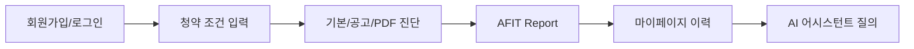
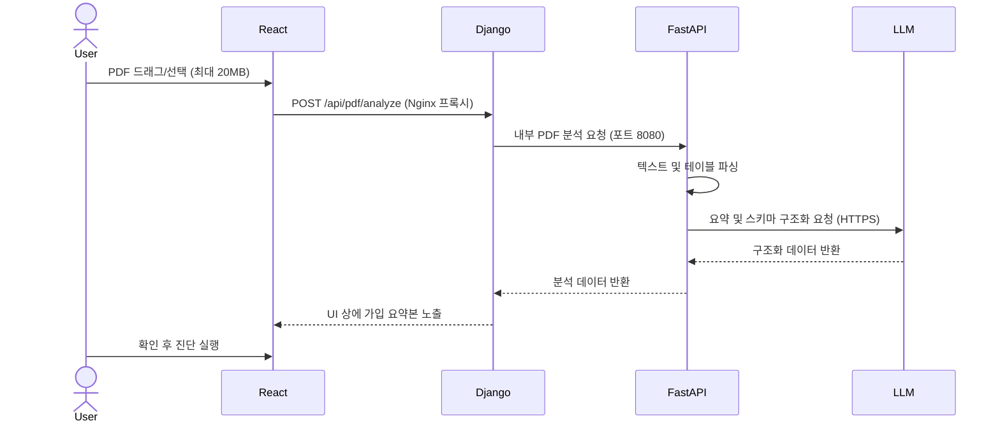

# 10분 발표자료 구성 가이드 (v2)

## 발표 핵심 메시지

이번 프로젝트의 핵심은 기존 청약 AI 진단 엔진을 실제 사용자가 접근할 수 있는 완성도 높은 웹서비스로 확장한 것입니다. React는 사용자 화면, Django는 Gunicorn WSGI 서버 기반으로 동작하는 인증·저장·공개 API 경계, FastAPI는 LangGraph·RAG·PDF 분석 AI 엔진을 담당하도록 분리했습니다. 또한 Docker Compose 기반의 배포 최적화를 수행하여 외부 도메인(`a-fit.duckdns.org`)의 웹 표준 포트(80)로 사용자가 직접 접속할 수 있는 실서버 환경 구축과 전수 검증을 완료했습니다.

## 추천 슬라이드 구성

| 순서 | 제목 | 핵심 내용 | 화면/자료 |
|---|---|---|---|
| 1 | 표지 | A-FIT 청약 진단 서비스 | 서비스명, 팀명 |
| 2 | 프로젝트 목표 | AI 진단 엔진을 실제 운영 가능한 웹서비스로 전환 | Before/After |
| 3 | 기존 한계와 개선 방향 | 사용자의 인증/이력/권한 관리 부재 극복 | 문제-해결 표 |
| 4 | 사용자 주요 흐름 | 회원가입 ➡️ 프로필 입력 ➡️ 기본/PDF 진단 ➡️ 결과 상세 ➡️ 이력 관리/AI 어시스턴트 | 플로우차트 |
| 5 | 전체 아키텍처 | React - Nginx - Gunicorn(Django) - FastAPI - DB 분리 및 포트 80 통합 | `SYSTEM_ARCHITECTURE_FINAL.md` Mermaid |
| 6 | 화면설계/UI 흐름 | 마이페이지, 결과 상세 Floating UI, 개편된 AI 어시스턴트 UX | 주요 화면 캡처 |
| 7 | PDF 분석 시퀀스 | PDF 업로드 ➡️ 텍스트/표 추출 ➡️ LLM/규칙 요약 ➡️ 전략 진단 연동 | 시퀀스 다이어그램 |
| 8 | LLM/RAG AI 어시스턴트 흐름 | ChromaDB 검색, OpenAI 답변 합성, 출처 표시 | RAG 흐름 |
| 9 | Docker/EC2 배포 구조 | Docker Hub push/pull, EC2 Gunicorn 서버 기동, Named 볼륨 데이터 보존 | 배포 가이드 요약 |
| 10 | 테스트 및 검증 결과 | lint/typecheck/test/build 패스, DB 보존 및 실서버 배포(포트 80) 검증 성공 | 테스트 결과 표 |
| 11 | 시연 | 기본 진단, PDF 업로드 진단, 마이페이지 계정 탈퇴, Floating AI 어시스턴트 시연 | 실제 동작 화면 |
| 12 | 한계와 후속 과제 | HTTPS(SSL), PostgreSQL/RDS 전환, S3 미디어 분리, 배포 smoke test 고도화 | TODO |

## 슬라이드별 발표 스크립트 요약

### 1. 표지
- "A-FIT은 사용자 청약 조건과 모집공고 분석을 바탕으로 맞춤형 가점 계산 및 적합도를 분석하는 청약 진단 웹서비스입니다."

### 2. 프로젝트 목표
- "기존에는 로컬 중심의 AI 계산 로직만 구현되어 사용자 데이터를 영구 저장하고 결과를 재조회하는 서비스 구조가 부재했습니다. 이번 프로젝트를 통해 실제 가동 가능한 3티어 웹 서비스로 전면 구조 개선을 단행했습니다."

### 3. 기존 한계와 개선 방향
| 기존 한계 | 개선 방향 |
|---|---|
| 사용자/세션/이력 관리 부족 | Django session, Profile, StrategyRun 모델 도입 및 영구저장 |
| 공고문 PDF 원문 가독성 저하 | PDF 파싱 추출 및 요약 정리본 제공 후 진단 연동 |
| 데이터 휘발 문제 | Named Volume 마운트 기반의 SQLite 영구 보존 구조 수립 |
| 화면 공간을 크게 차지하는 AI 어시스턴트 | 우하단 Floating 버튼 및 패널 디자인 개편 |

### 4. 사용자 주요 흐름

### 5. 전체 아키텍처
- 프론트엔드(React)는 Nginx 웹서버를 통해 정적 파일을 서빙받습니다.
- Nginx는 모든 트래픽(포트 80)을 받아 정적 화면을 보여주고, API 요청(`/api/`)과 어드민 요청(`/admin/`)만 백엔드 컨테이너의 Gunicorn WAS(포트 8000)로 가로채 안전하게 전달(Reverse Proxy)합니다.
- 백엔드(Django)는 FastAPI(포트 8080) AI 서버와만 통신하여 연산을 수행하므로, 외부 해커가 백엔드 포트에 직접 접근할 수 없는 망 격리를 이룩했습니다.

### 6. 화면설계/UI 흐름
- 기존 `진단 기록` 탭을 **`마이페이지`**로 통합 개편하여 계정 정보, 기본 정보 진단, 공고 분석을 계층적으로 배치했습니다.
- 결과 상세 화면에서는 언제든 사용자 조건과 비교해볼 수 있게 `내 프로필` 보기 Floating UI를 띄워 스냅샷 정보를 제공합니다.
- AI 어시스턴트는 Floating 버튼으로 변경하여 모바일에서도 화면 가림 현상을 최소화했습니다.

### 7. PDF 분석 시퀀스

### 8. LLM/RAG 안정성
- 수학적 가점 및 청약 자격 계산은 100% 코드가 수행하여 LLM 특유의 환각(Hallucination) 에러를 방지했습니다.
- LLM은 오직 공고문 구조화, 설명 텍스트 요약, RAG 답변 합성에만 사용됩니다.
- PDF 파싱이나 RAG 검색 실패 시에도 전체 서비스 흐름이 터지지 않고 규칙 기반 요약이나 안내 문구를 노출(Fallback)하도록 견고하게 설계되었습니다.

### 9. Docker/EC2 배포 구조
- "로컬 빌드 기반의 `docker-compose.yml`과 실배포용 `docker-compose.prod.yml`을 이원화했습니다. 로컬에서 빌드된 이미지를 Docker Hub에 푸시하고, AWS EC2에서 `docker compose pull`만 하면 1초 만에 최신 서버로 교체 가동되는 경량화된 무중단 수준의 배포 파이프라인을 구축했습니다."
- "이후 운영 고도화를 위해 HTTPS(SSL) 연동, PostgreSQL 및 AWS RDS/S3 전환을 후속 과제로 분리했습니다."

### 10. 테스트 및 검증 결과
- **검증 완료 항목:** `pnpm lint`, `pnpm typecheck`, `pnpm test`, `pnpm build`를 전체 패스했습니다.
- Django accounts 회원가입/로그인/탈퇴 기능의 테스트 커버리지를 검증했습니다.
- **실서버 기동 및 외부 접속 연동 확인:** `a-fit.duckdns.org` 고정 도메인을 통해 포트 80 접속 및 회원가입 테스트가 정상 작동함을 직접 전수 확인 완료했습니다.

### 11. 시연 순서
1. 로그인화면 진입 및 회원가입 시연 (CSRF 쿠키-헤더 검증 작동)
2. 마이페이지 계정 정보 확인
3. 기본 진단 실행 및 결과 화면으로 이동
4. 결과 화면에서 `내 프로필` Floating 버튼 클릭 후 스냅샷 팝업 확인
5. 전략 진단 화면으로 이동 후 PDF 업로드 및 분석 요약본 생성 시연
6. Floating AI 어시스턴트를 열어 자유 질의 수행 및 하단 법령 출처 표시 확인

### 12. 한계와 후속 과제
- SQLite ➡️ PostgreSQL 및 AWS RDS 마이그레이션
- HTTP 통신 ➡️ SSL 인증서 발급(Certbot)을 통한 HTTPS 보안 강화 및 쿠키 보안 설정 활성화
- GitHub Actions CI/CD는 구현 완료, 향후 배포 후 smoke test와 실패 알림 자동화 고도화

---

## 발표 전 체크리스트 (v2)

- [x] PR merge 후 final 브랜치 기준 소스 점검 완료
- [x] 로컬 PC에서 최신 도커 이미지 빌드 및 `docker-compose push` 완료
- [x] EC2 서버 터미널에서 `docker compose pull && docker compose up -d` 수행 완료
- [x] EC2에서 `docker ps` 입력 시 3개 서비스가 정상 기동(`Up`)하고 있으며 프론트엔드가 `80:80` 포트로 돌고 있는지 확인 완료
- [x] 외부 도메인 주소 `http://a-fit.duckdns.org/`로 포트 입력 없이 정상 접속 및 동작 확인 완료
- [x] 전체 사용자 시나리오 흐름 리허설 통과 완료
