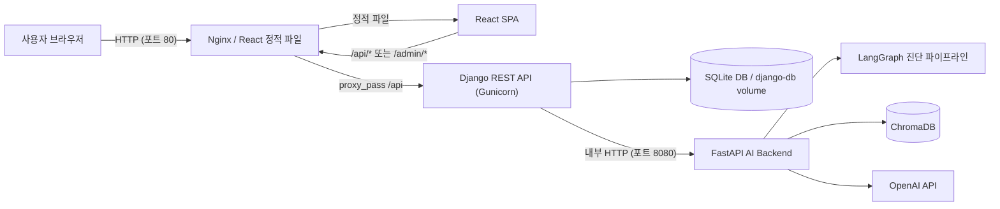
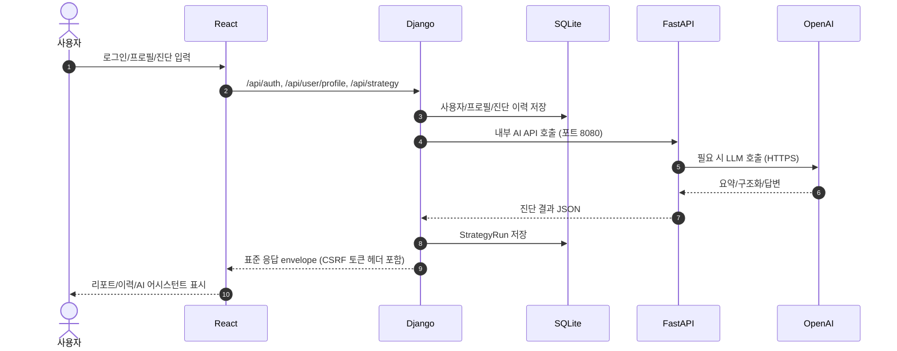
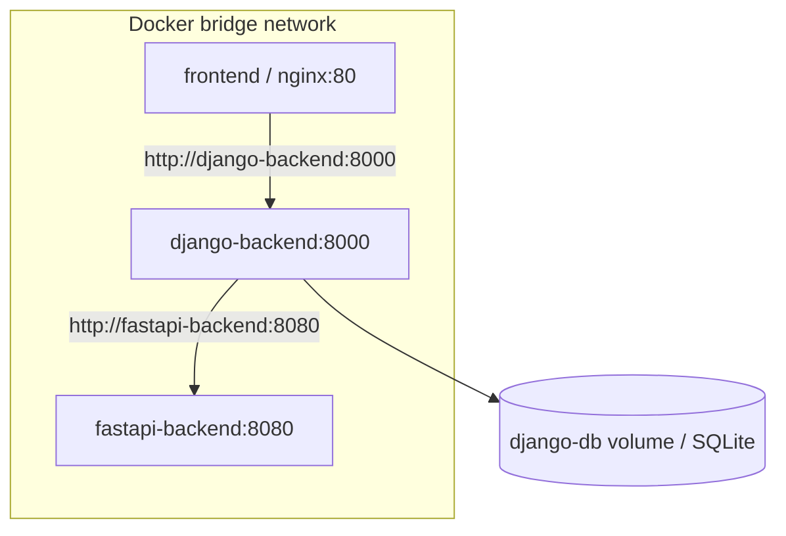
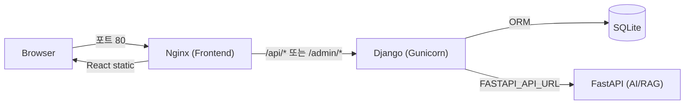
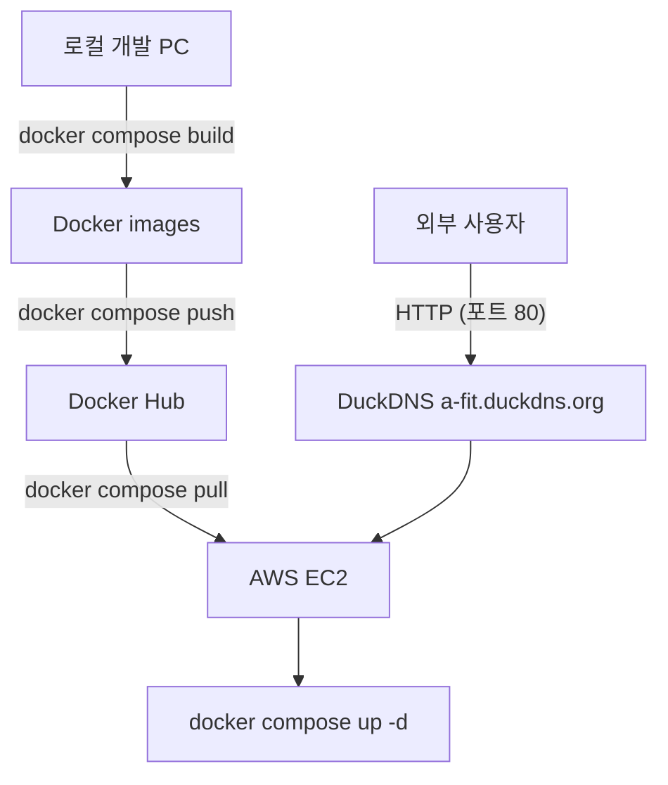

# 시스템 구성도 최종본 (v2)

| 항목 | 내용 |
|---|---|
| 프로젝트 | A-FIT 청약 진단 서비스 |
| 작성일 | 2026-07-09 |
| 문서 상태 | 최종 제출 완료본 |
| 기준 | React / Django / FastAPI / SQLite / ChromaDB / OpenAI |

## 1. 전체 아키텍처

핵심 분리는 다음과 같다.

| 계층 | 책임 |
|---|---|
| React | 사용자 화면, 입력, 로딩/오류, 결과 표시 |
| Nginx | React 정적 파일 제공, `/api` 및 `/admin` 요청을 Django로 프록시, PDF 업로드 edge limit (20MB) |
| Django | 인증, 세션, 사용자 프로필, 진단 이력 저장, Gunicorn WSGI 서버 기반 처리, FastAPI proxy |
| FastAPI | LangGraph 진단, RAG AI 어시스턴트, PDF 텍스트/표 추출, LLM 호출 |
| SQLite | 사용자, 프로필, 진단 이력 저장 |
| ChromaDB | RAG 검색 collection |
| OpenAI API | 공고문 구조화, 요약, 설명 생성, RAG 답변 합성 |

## 2. 요청 흐름

## 3. Docker Compose 구성

현재 repository에는 실제 로컬 개발 및 EC2 운영 배포에 사용하는 가동용 compose 파일이 구성되어 있다.

| 파일 | 용도 | 상태 |
|---|---|---|
| `docker-compose.yml` | 로컬 빌드 및 볼륨 마운트 기반 3개 서비스 실행 | 검증 완료 |
| `docker-compose.prod.yml` | Docker Hub 이미지 pull 기반 EC2 운영 기동 | **검증 완료 (EC2 실서버 가동 상태)** |

서비스 구성은 다음과 같다.

| 서비스 | 이미지 | 내부 포트 | 호스트 포트 | 비고 |
|---|---|---|---|---|
| frontend | `dongyoon99/frontend-react:latest` | 80 | **`80:80`** | React build + Nginx (웹 표준 포트 진입) |
| django-backend | `dongyoon99/django-backend:latest` | 8000 | `8000:8000` | Gunicorn WSGI 구동, DB 보존, proxy |
| fastapi-backend | `dongyoon99/fastapi-backend:latest` | 8080 | `8080:8080` | AI/RAG/PDF |
| django-db | Docker volume | - | - | SQLite 파일 영구 보존 (`django-db:/app/data`) |

* **확인 사항:** 실제 배포 및 Nginx 인입을 위해 `docker-compose.prod.yml`의 호스트 포트는 **`80:80`**으로 매핑되어 가동 중이다. 이에 따라 외부에서 접속 시 별도의 포트 번호(`:3000`)를 붙일 필요가 없다.

## 4. Nginx-Django-FastAPI 구조

Nginx 설정 및 경로 구성:
- `/api/` 요청은 `http://django-backend:8000/api/`로 프록시 전달
- `/admin/` 및 `/static/admin/` 요청을 `http://django-backend:8000/admin/`으로 프록시 전달 (관리자 페이지 포트 80 통합)
- SPA 라우팅 지원: `try_files $uri $uri/ /index.html`
- PDF multipart 업로드 고려: Nginx edge limit `client_max_body_size 20m` 설정 완료
- `proxy_read_timeout`, `proxy_send_timeout`은 120초 기준 동작

## 5. 클라우드/배포 구조

| 항목 | 현재 실제 배포 상태 |
|---|---|
| EC2 | `t2.micro` 인스턴스에 고정 IP 및 SSH 연동 완료 |
| Docker Hub | `dongyoon99/*` 공용 레포지토리 이미지 푸시 및 풀 테스트 완료 |
| DuckDNS | `a-fit.duckdns.org` 도메인과 EC2 IP 연동 완료 |
| HTTPS | 미적용. 후속 과제 (Let's Encrypt / Certbot 설정 필요) |
| RDS/S3 | 미적용. 후속 과제 (PostgreSQL 및 AWS S3 전환 계획) |
| CI/CD | GitHub Actions 기반 검증, 이미지 빌드/푸시, EC2 배포 흐름 구현 완료 |

## 6. 보안/확장성 고려사항

| 항목 | 현재 구현 상태 | 후속 과제 |
|---|---|---|
| 인증 | Django session 기반 | 유지 |
| 권한 | 사용자별 프로필/진단 이력 격리 | 유지 |
| API 경계 | React -> Nginx(포트 80 단일 통로) -> Django -> FastAPI | 유지 |
| 비밀값 | `.env` 보안 설정, `.env.production.example` 양식 | 실제 운영 값은 Git 제외 |
| DB | SQLite + named volume | PostgreSQL/RDS 전환 |
| 정적 파일 | Nginx 자체 서빙 및 Gunicorn + Whitenoise 연동 완료 | S3/CloudFront 전환 |
| HTTPS | DuckDNS 도메인 연동 상태 | 인증서 발급 및 리버스 프록시 적용 |
| 쿠키 보안 | 환경변수(`DJANGO_SESSION_COOKIE_SECURE=false`) 제어 | HTTPS 연동 시 `true` 전환 |

## 7. 실제 배포 및 프로세스 검증 결과

* 본 프로젝트는 단순히 파일 및 가이드만 작성한 것이 아니라, **로컬 Docker 이미지 빌드 및 푸시, EC2 상에서의 풀 및 컨테이너 가동을 실제로 완료하여 외부망에서 접속 및 동작을 전수 검증**하였다.
* Gunicorn 서버 가동을 통해 파이썬 멀티프로세스 동시 처리가 가능한 정석 배포 아키텍처를 구현 완료하였다.
* 외부 방화벽(AWS 보안 그룹)에서는 포트 `80`만 열어두고 `8000`, `8080` 포트는 외부 접속을 차단함으로써 망 격리를 통한 강력한 1차 보안을 확립하였다.
