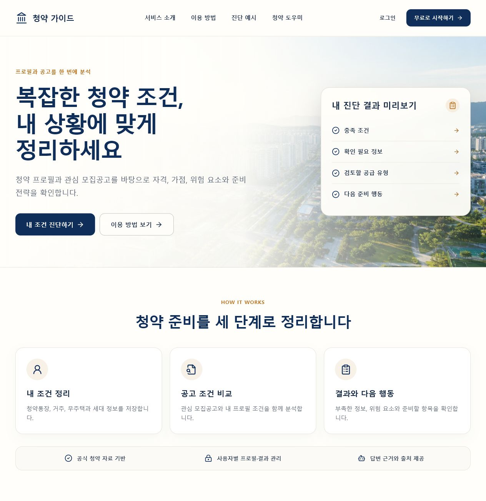
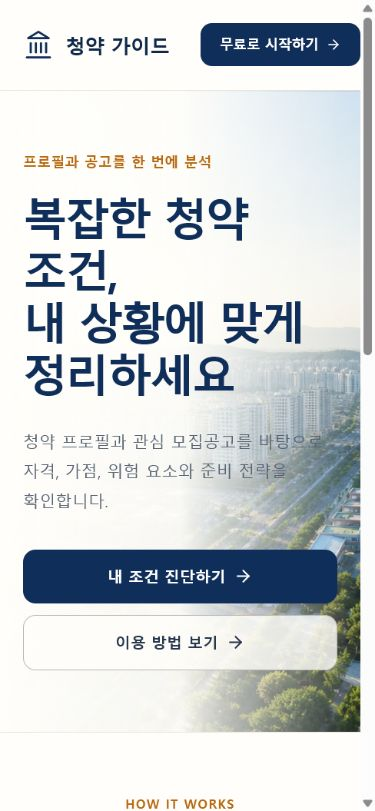
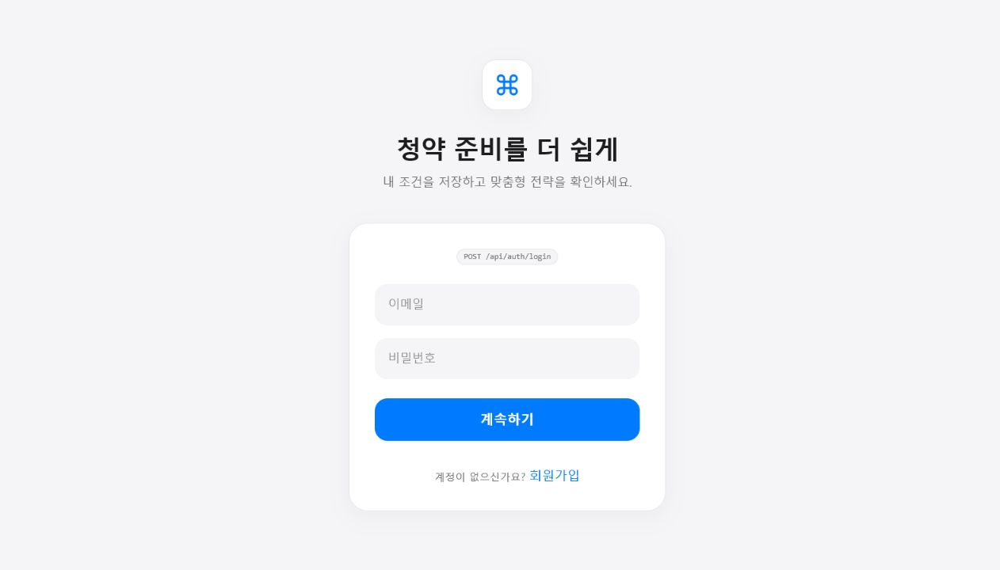
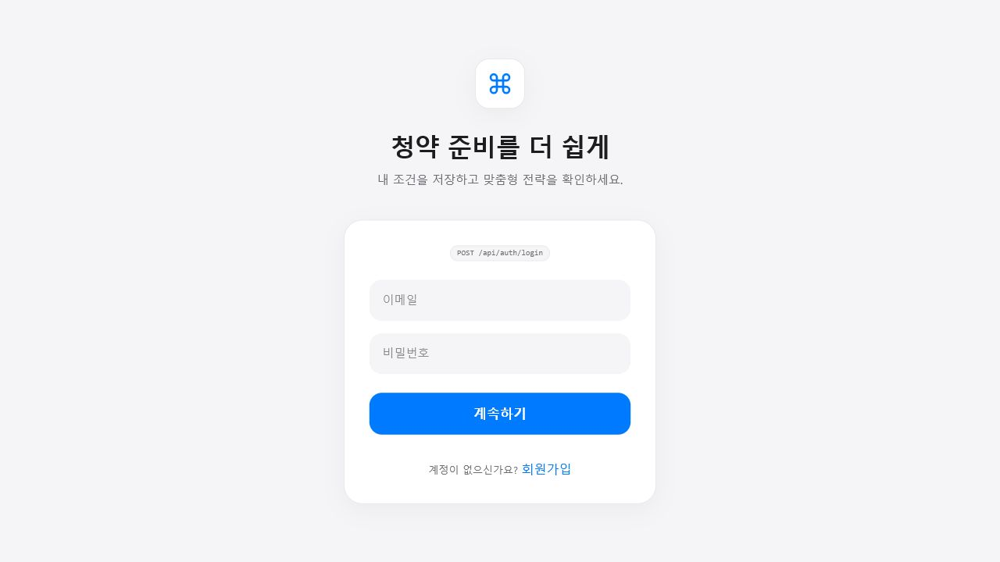

# 개선 전 UI 캡처

현재 `eunjin/frontend`의 UI 개선 전 상태를 확인하기 위해 과거 브랜치를 별도 워크트리에서 실행해 캡처했습니다.

## 캡처 기준

| 기준 브랜치 | 커밋 | 확인 화면 | 비고 |
|---|---|---|---|
| `version-1` | `e93260a` | 랜딩(데스크톱·모바일), 로그인 | 랜딩과 인증 UI의 개선 전 상태 |
| `final` | `77ba11a` | 로그인 | `/`가 `/profile`로 이동하며 인증 API가 필요해 로그인만 캡처 |

## 캡처 이미지

### version-1 랜딩 — 데스크톱

### version-1 랜딩 — 모바일

### version-1 로그인

### final 로그인

## 개선 전 확인 사항

| 구분 | 개선 전 상태 |
|---|---|
| 랜딩 헤더 | `로그인`과 `무료로 시작하기`가 유사한 인증 진입 기능으로 중복 노출됨 |
| 서비스 명칭 | 현재 명칭인 `청약 진단 서비스`가 아니라 `청약 가이드`로 표시됨 |
| 로그인·회원가입 구분 | 별도 탭이나 명확한 화면 제목 없이 링크로만 전환함 |
| 개발 정보 노출 | 인증 카드에 `POST /api/auth/login` 같은 API 경로가 노출됨 |
| 모바일 내비게이션 | 주요 기능 탭과 챗봇 진입 동선이 없음 |
| 반응형 랜딩 | 모바일에서 큰 히어로 영역 위주로 구성되어 주요 기능 탐색성이 낮음 |

## 재현 범위 제한

과거 브랜치는 현재 백엔드 계약과 인증 상태가 다릅니다. 보호 라우트인 프로필·전략 진단 화면은 과거 Django/FastAPI 환경 없이 프론트만 실행할 경우 정상 진입할 수 없어 캡처 대상에서 제외했습니다. 캡처를 위해 소스 코드는 수정하지 않았습니다.
