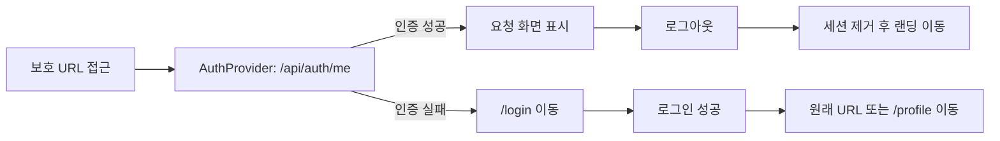

# 프론트엔드 화면설계서

작성일: 2026-07-06
대상: 청약 진단 서비스 React 프론트엔드
구조: React SPA → Django REST API → FastAPI/LangGraph

## 1. 공통 설계 원칙

| 항목 | 설계 |
|---|---|
| 라우팅 | React Router 기반 URL 라우팅 |
| 인증 | Django session cookie, `AuthProvider`에서 현재 사용자 조회 |
| 보호 화면 | 비로그인 사용자가 보호 URL에 접근하면 `/login`으로 이동 |
| 반응형 | 데스크톱 상단 탭·우측 챗봇, 모바일 상단 스크롤 탭·챗봇 전용 화면 |
| 비동기 UX | 요청 중 버튼 비활성화, 로딩 상태, 오류 안내, 장시간 요청 중복 실행 방지 |
| 오류 표현 | HTTP/API 오류를 사용자 문구와 필드 오류로 변환 |
| 데이터 원칙 | 화면은 Django 공개 API만 호출하며 FastAPI를 직접 호출하지 않음 |

## 2. 공통 레이아웃

| 영역 | 데스크톱 | 모바일·태블릿 |
|---|---|---|
| 헤더 | 서비스명, 홈·조건·전략·기록·챗봇 탭, 사용자·로그아웃 | 2단 헤더와 가로 스크롤 탭 |
| 본문 | 최대 폭이 제한된 중앙 콘텐츠 | 화면 폭에 맞춘 단일 열 |
| 챗봇 | `xl` 이상에서 우측 고정 패널 | `/chatbot` 전용 화면 |
| 인증 확인 | 사용자 조회 중 안내 후 보호 화면 렌더링 | 동일 |

## 3. 화면별 설계

| 화면 | URL | 목적 | 주요 입력 | 로딩 상태 | 성공 상태 | 오류 상태 | 빈 상태 | 연결 API |
|---|---|---|---|---|---|---|---|---|
| 랜딩 | `/` | 서비스 범위와 이용 흐름 안내, 진단 시작 | 진단 시작·이용 방법 버튼 | 로그인 상태 확인 중 CTA 비활성화 | 로그인 사용자는 전략 진단, 비로그인은 로그인 화면으로 이동 | 인증 조회 실패 시 비로그인 상태로 표시 | 해당 없음 | `GET /api/auth/me` |
| 로그인·회원가입 | `/login` | 계정 생성 및 세션 로그인 | 이메일, 비밀번호, 비밀번호 확인 | 제출 버튼에 로그인·가입 처리 중 표시 | 인증 상태 저장 후 원래 보호 URL 또는 `/profile` 이동 | 이메일 중복, 비밀번호 규칙, 인증 실패를 상단 안내 | 입력 전 기본 폼 | `POST /api/auth/login`, `POST /api/auth/signup` |
| 내 청약 조건 | `/profile` | 전략 진단에 사용할 사용자 조건 조회·저장 | 청약통장, 거주, 무주택, 세대, 혼인, 자녀, 소득·자산 | 저장 프로필 조회 중 기본 화면 유지 | 저장 완료 안내 | 조회·검증·저장 오류를 필드 중심으로 표시 | 프로필 404이면 신규 작성 상태 | `GET /api/user/profile`, `PUT /api/user/profile` |
| 전략 진단 | `/strategy` | 프로필 단독 또는 공고문 기반 전략 실행 | 공고문 텍스트, 공고 없이 진단 체크, PDF 전달 텍스트 | 실행 버튼 스피너, 입력·이동 비활성화 | 완료 후 `/results/{id}` 이동 | 타임아웃, 프로필 누락, 분석 서버 실패 안내 | 공고문 미입력 시 실행 비활성화 | `POST /api/strategy` |
| 진단 기록 | `/mypage` | 계정 정보와 저장된 진단 목록 재조회 | 새로고침, 기록 선택 | 목록 조회 및 새로고침 표시 | 기록 카드와 상태 표시 | 조회 실패 안내 | 저장된 진단이 없음을 안내 | `GET /api/auth/me`, `GET /api/strategy/me` |
| 진단 상세 | `/results/:id` | 추천 공급유형, 요약, 재무, 상세 전략과 확인 항목 표시 | 프로필 보완·PDF 분석 이동 | 현재 별도 스켈레톤 없이 결과 수신 후 렌더링 | 구조화된 요약·전략·확인 항목 표시 | 상세 조회 실패 안내 | 분석·확인 항목이 없으면 명시적 빈 문구 | `GET /api/strategy/{id}` |
| PDF 분석 | `/pdf` | 모집공고 PDF의 텍스트·표 추출 | PDF 파일 | 업로드 영역 회전 로더, 입력 비활성화 | 파일·페이지·추출량·미리보기 표시 후 전략 화면 전달 | 파일 형식·크기·분석 실패 안내 | 파일 선택 안내 | `POST /api/pdf/analyze` |
| 챗봇 | `/chatbot` 및 데스크톱 우측 패널 | 청약 제도 RAG 질의응답 | 질문, 추천 질문, 새 대화 | 답변 작성 중 점 애니메이션과 입력 비활성화 | 구조화 답변과 참고 출처 토글 | 답변 실패 메시지 | 인사말과 화면별 추천 질문 | `POST /api/chatbot` |

## 4. 조건부 입력 설계

| 기준 입력 | 조건 | 추가 노출 항목 | 조건 해제 시 |
|---|---|---|---|
| 거주 지역 | 지역 선택 | 현재 지역 거주 기간 | 관련 값 초기화 |
| 무주택 여부 | 무주택 | 무주택 기간 | 관련 값 초기화 |
| 혼인 상태 | 기혼 | 혼인 기간, 맞벌이 여부 | 관련 값 초기화 |
| 세대원 수 | 2명 이상 | 부양가족 수 | 관련 값 초기화 |
| 미성년 자녀 수 | 1명 이상 | 영유아 자녀 수, 가장 어린 자녀 연령대 | 관련 값 초기화 |
| 노부모 부양 상태 | 만 65세 이상 3년 이상 부양 | 부양 노부모 무주택 여부 | 관련 값 초기화 |

## 5. 인증 흐름

## 6. LLM 상호작용 상태

| 상태 | 전략 진단 | 챗봇 | PDF 분석 |
|---|---|---|---|
| 대기 | 입력 가능 | 추천 질문·입력 가능 | 파일 선택 가능 |
| 요청 중 | 중복 실행·화면 이동 방지 | 입력 비활성화·답변 작성 표시 | 파일 재선택 방지·회전 로더 |
| 성공 | 결과 상세 이동 | 답변·출처 표시 | 추출 결과와 전략 전달 버튼 |
| 실패 | 사용자용 오류 안내 | 오류 메시지 버블 | 형식·네트워크·서버 오류 안내 |
| 장시간 | 프론트 타임아웃 적용 | Django timeout 결과 표시 | 서버 응답까지 로딩 유지 |

## 7. 구현 파일 매핑

| 설계 영역 | 구현 파일 |
|---|---|
| URL 매핑 | `frontend-react/src/app/routes.tsx` |
| 공통 레이아웃 | `frontend-react/src/app/components/Layout.tsx` |
| 상단 내비게이션 | `frontend-react/src/app/components/SiteHeader.tsx` |
| 인증 상태 | `frontend-react/src/app/auth/AuthContext.tsx` |
| 공통 API·오류 | `frontend-react/src/app/api/client.ts`, `errorPresentation.ts` |
| 공통 UI | `frontend-react/src/app/components/UI.tsx` |
| 챗봇 | `frontend-react/src/app/components/ChatbotPanel.tsx` |
| 개별 화면 | `frontend-react/src/app/pages/*.tsx` |

## 8. 현재 보완 필요 사항

- 진단 상세 화면에 조회 스켈레톤 추가
- React Testing Library 기반 실제 DOM 상호작용 테스트
- 키보드 포커스·색상 대비·스크린리더 접근성 점검
- 모바일 320px, 375px, 태블릿, 데스크톱 해상도별 회귀 캡처 자동화
- 운영 CSRF 토큰 전달 방식 적용 후 인증 회귀 테스트
