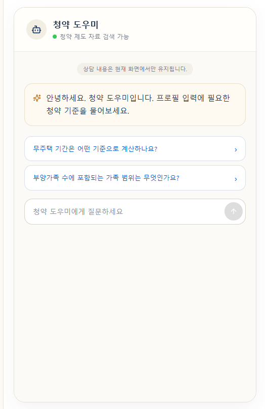
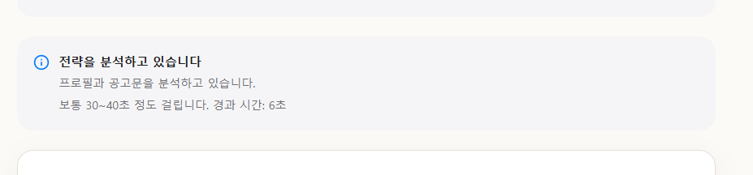
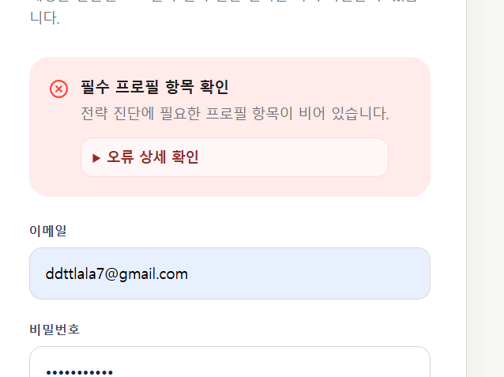

# 프론트엔드 테스트 결과 보고서

작성일: 2026-07-06  
대상 브랜치: `eunjin/frontend`  
대상 경로: `frontend-react`

## 1. 테스트 목적

평가계획서의 인증, 반응형 UI, LLM 비동기 UX, 예외·로딩 처리와 핵심 사용자 흐름을 프론트 기준으로 검증한다.

## 2. 테스트 환경

| 항목 | 값 |
|---|---|
| OS | Windows |
| Node.js | v24.18.0 |
| 패키지 관리자 | pnpm |
| 프레임워크 | React 18, React Router 7, Vite 6, Tailwind CSS 4 |
| 자동 테스트 | Node.js 내장 test runner |

## 3. 자동 테스트 결과

실행 명령:

```powershell
cd frontend-react
pnpm.cmd test
```

| ID | 검증 내용 | 결과 |
|---|---|---|
| TC-01 | 로그인·회원가입 API 연결과 비밀번호 확인 | 통과 |
| TC-02 | 보호 라우팅, 현재 사용자 조회, session cookie | 통과 |
| TC-03 | 프로필 조건부 입력과 숨김 값 초기화 | 통과 |
| TC-04 | API 오류의 사용자·필드 메시지 매핑 | 통과 |
| TC-05 | 챗봇 메시지와 `session_id` 세션 유지 | 통과 |
| TC-06 | 모바일 내비게이션과 챗봇 전용 URL | 통과 |
| TC-07 | 전략·PDF 로딩, 중복 실행 방지, 타임아웃 | 통과 |

결과 요약:

```text
tests 7
pass 7
fail 0
duration_ms 186.0918
```

## 4. 빌드 검증

실행 명령:

```powershell
pnpm.cmd run build
```

| 검증 | 결과 |
|---|---|
| TypeScript/Vite 변환 | 통과, 1,624 modules |
| 프로덕션 번들 생성 | 통과 |
| 최종 빌드 시간 | 11.28초 |
| 빌드 오류 | 없음 |

## 5. 화면 검증 및 QA 캡처

현재 저장된 이미지는 사용자가 기능 개선 요청 시 제공한 **개선 전 QA 캡처**다. 문제 재현 근거로 보존하며, 최종 반영 화면 캡처는 개발 서버 재실행 후 같은 폴더에 추가해야 한다.

| 증빙 | 확인된 문제·검증 항목 | 파일 |
|---|---|---|
| 챗봇 화면 | 좁은 화면의 빈 공간, 추천 질문과 입력창 배치 확인 | `docs/frontend/evidence/qa-chatbot-before.png` |
| 로딩 화면 | 전략 분석 중 중복 안내 박스 확인 | `docs/frontend/evidence/qa-loading-before.png` |
| 오류 화면 | 실제 필드 오류보다 상위 오류 제목이 강조되는 문제 확인 | `docs/frontend/evidence/qa-login-error-before.png` |

### 챗봇 QA 캡처 - 개선 전



### 분석 로딩 QA 캡처 - 개선 전



### 로그인 오류 QA 캡처 - 개선 전



### 최종 캡처 체크리스트

- [ ] 375px 모바일 랜딩과 모바일 상단 탭
- [ ] 모바일 `/chatbot` 화면과 하단 고정 입력창
- [ ] PDF 업로드 로딩 스피너
- [ ] 중복 이메일의 `이메일 확인` 오류 메시지
- [ ] 전략 진단 실행 버튼의 로딩·비활성화 상태

## 6. 테스트 수준과 한계

- 현재 자동 테스트는 외부 패키지 없이 실행되는 **소스 계약 회귀 테스트**다.
- API 연결, 보호 라우팅, 조건부 UI, 오류·로딩·세션 구현이 소스에서 제거되거나 변경되는 회귀를 감지한다.
- 실제 DOM 클릭·입력·포커스·네트워크 모킹 테스트는 아니다.
- Testing Library/Vitest 설치가 가능한 환경에서는 컴포넌트 렌더링 테스트로 확장해야 한다.
- Django/FastAPI 통합 테스트와 운영 CSRF 검증은 이 보고서 범위 밖이다.

## 7. 후속 테스트 계획

| 우선순위 | 테스트 |
|---|---|
| P0 | 로그인 성공·실패, 보호 URL 복귀 E2E |
| P0 | 프로필 저장과 조건부 필드 입력 E2E |
| P0 | 전략 진단 성공·타임아웃·502 모킹 |
| P1 | 챗봇 후속 질문과 출처 토글 |
| P1 | PDF 형식 오류·업로드·전략 전달 |
| P1 | 320px·375px·768px·1440px 시각 회귀 |
| P2 | 키보드 탐색, aria-label, 색상 대비 자동 검사 |
