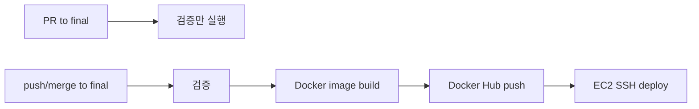

# GitHub Actions CI/CD 설정 가이드

본 문서는 A-FIT 프로젝트의 Docker Hub 이미지 빌드, 푸시, AWS EC2 배포를 GitHub Actions로 자동화하기 위한 설정 가이드입니다.

## 1. 적용된 자동화 흐름

`.github/workflows/deploy.yml`은 다음 흐름으로 동작합니다.



| 이벤트 | 동작 |
|---|---|
| `pull_request -> final` | Python 테스트, Django check/test, Frontend lint/typecheck/test/build |
| `push -> final` | 검증 후 Docker 이미지 3개 빌드/푸시, EC2 배포 |
| `workflow_dispatch` | GitHub Actions 화면에서 수동 실행 |

## 2. GitHub Repository Secrets 등록

GitHub 저장소에서 `Settings -> Secrets and variables -> Actions -> New repository secret`으로 아래 값을 등록합니다.

| Secret | 값 |
|---|---|
| `DOCKERHUB_USERNAME` | Docker Hub 계정명, 예: `dongyoon99` |
| `DOCKERHUB_TOKEN` | Docker Hub Access Token 또는 비밀번호 |
| `EC2_HOST` | EC2 IP 또는 host, 예: `43.201.113.124` |
| `EC2_USER` | SSH 사용자, 예: `ubuntu` |
| `EC2_SSH_KEY` | `cheongyak-key.pem` 파일 전체 내용 |
| `OPENAI_API_KEY` | 운영 OpenAI API Key |
| `DJANGO_SECRET_KEY` | 운영 Django secret key |

`EC2_SSH_KEY`는 파일 경로가 아니라 private key 파일 내용 전체를 넣어야 합니다.

PowerShell에서 키 내용을 확인할 때는 아래 명령을 사용합니다.

```powershell
Get-Content "C:\SKN_29th\python-src\ex\02_unit_projects\SKN_Project\4th_project\branching\secrets\cheongyak-key.pem" -Raw
```

## 3. Docker Hub 준비

아래 이미지 저장소에 push 권한이 있어야 합니다.

| 서비스 | 이미지 |
|---|---|
| React/Nginx | `dongyoon99/frontend-react` |
| Django | `dongyoon99/django-backend` |
| FastAPI | `dongyoon99/fastapi-backend` |

Docker Hub Collaboration 초대가 되어 있다면, GitHub Actions에서 사용하는 Docker Hub 계정 또는 토큰이 해당 저장소에 push할 수 있어야 합니다.

## 4. EC2 서버 준비

EC2에는 Docker와 Docker Compose plugin이 설치되어 있어야 하며, `~/app` 디렉터리를 사용합니다.

```bash
docker --version
docker compose version
mkdir -p ~/app
```

배포 시 Actions가 `docker-compose.prod.yml`을 EC2의 `~/app/docker-compose.yml`로 전송합니다. 이후 운영 환경 변수는 `~/app/runtime.env`로 생성하고, `docker compose pull`, `docker compose up -d`를 실행합니다.

운영에서는 Compose의 기본 `.env` 자동 치환과 secret 값의 `$` 문자가 충돌할 수 있으므로, Actions 배포 단계에서 기존 `~/app/.env`를 제거하고 `runtime.env`를 사용하도록 구성하였습니다.

## 5. 배포 확인 명령

EC2에 접속해 아래 명령으로 상태를 확인합니다.

```bash
cd ~/app
docker compose ps
docker compose logs --tail=100
```

외부에서는 아래 URL을 확인합니다.

```text
http://a-fit.duckdns.org/
http://a-fit.duckdns.org/admin/
```

## 6. 자주 나는 오류와 대응

| 오류 | 원인 | 대응 |
|---|---|---|
| `Login to Docker Hub` 실패 | `DOCKERHUB_USERNAME` 또는 `DOCKERHUB_TOKEN` 오류 | GitHub Secret 값을 다시 등록하고 Docker Hub 토큰 권한 확인 |
| `denied: requested access to the resource is denied` | Docker Hub 저장소 push 권한 없음 | Collaboration 권한 또는 저장소명을 확인 |
| `Permission denied (publickey)` | `EC2_SSH_KEY` 내용이 잘못되었거나 `EC2_USER`가 다름 | private key 전체 내용, `ubuntu` 사용자 여부 확인 |
| `ssh-keyscan` 실패 | `EC2_HOST`가 잘못되었거나 EC2 보안그룹 차단 | IP/도메인, 22번 포트 인바운드 규칙 확인 |
| `docker compose: command not found` | EC2에 Compose plugin이 없음 | `sudo apt install docker-compose-plugin` 설치 |
| `runtime.env` 관련 런타임 오류 | 필수 운영 Secret 누락 | `OPENAI_API_KEY`, `DJANGO_SECRET_KEY` 등 Actions Secrets 확인 |
| 웹은 뜨지만 API 실패 | Nginx proxy 또는 컨테이너 네트워크 문제 | `docker compose logs frontend django-backend fastapi-backend` 확인 |
| `/admin/` 정적 파일 깨짐 | Django collectstatic 또는 Nginx admin static proxy 문제 | Django 컨테이너 로그와 `/static/admin/` proxy 설정 확인 |

## 7. 롤백 방법

현재 워크플로는 `latest`와 commit SHA 태그를 함께 push합니다. 특정 커밋 이미지로 되돌릴 때는 EC2의 `docker-compose.yml`에서 이미지 태그를 해당 SHA로 바꾼 뒤 재기동합니다.

```bash
cd ~/app
docker compose pull
docker compose up -d
```

긴급 상황에서는 직전 정상 커밋 SHA를 기준으로 세 이미지 태그를 모두 맞추는 것을 권장합니다.
